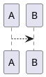
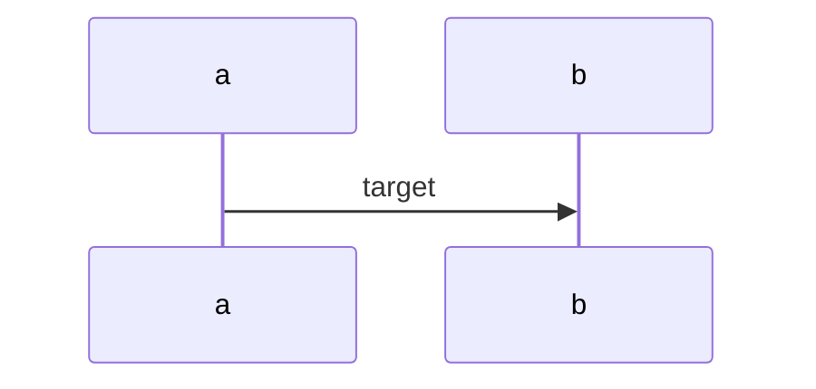

## a "hello world" program

### cpp program

```c++
#include <iostream>

int main() 
{
    std::cout << "Hello, World!" << std::endl;
    return 0;
}
```

### python program

```python
print("Hello, World!")
```

## Diagram

### plantuml

`demo plantuml`



```




```


