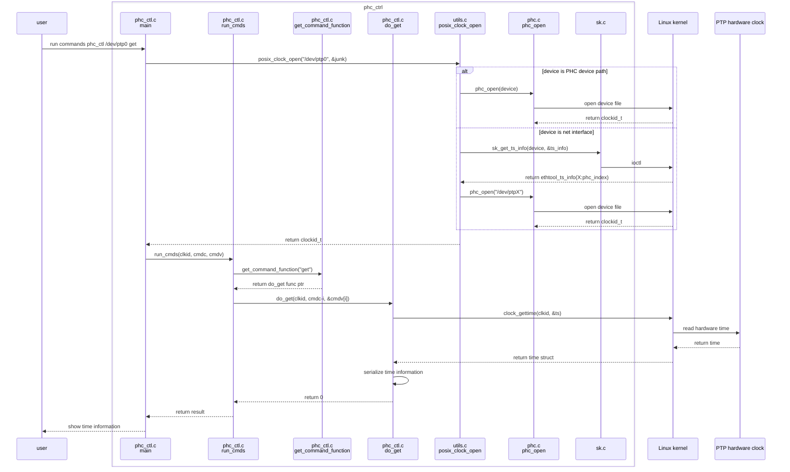
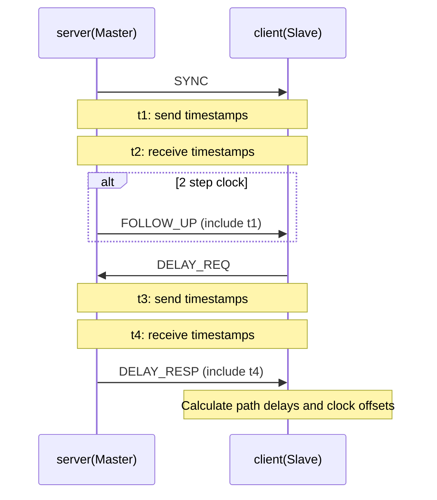
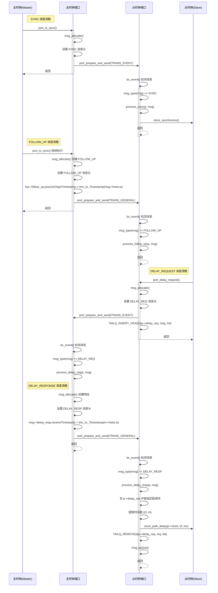

## 1 前言

linuxptp 是linux平台上根据IEEE standard 1588的一个Precision Time Protocol (PTP)协议实现.
更多的特性介绍可以参考页面
[linuxptp feature](https://github.com/richardcochran/linuxptp?tab=readme-ov-file#features)
这里我们尝试从功能和源码的角度进行分析

## 2 源码分析

https://github.com/richardcochran/linuxptp


### 2.1 从phc_ctl看ptp时间查询

```
phc_ctl.c
phc.c
sk.c
utils.c
```



关键步骤为
`phc_open`打开ptp设备, 拿到clkid, `clock_gettime`获取时间


### 2.2 E2E mode

- t1: Master发送SYNC报文的时间点
- t2: Slave收到SYNC报文的时间点, Master通过FOLLOW_UP的payload把t1发送给Slave
- t3: Slave发送DELAY_REQ报文的时间点
- t4: Master收到DELAY_REQ报文的时间点, Master通过DELAY_RESP的payload把t3发送给Slave





详细的序列图


> 以下以UDP port为例

#### 2.2.1 Master Send

Master在`port_tx_sync`流程中最终通过`sk_receive`获取到SYNC报文的发送时间点t1

```c++
// port.c
int port_tx_sync(struct port *p, struct address *dst, uint16_t sequence_id)
{
    // send SYNC
    err = port_prepare_and_send(p, msg, event);
    
    // send FollowUp
    fup->follow_up.preciseOriginTimestamp = tmv_to_Timestamp(msg->hwts.ts);

    err = port_prepare_and_send(p, fup, TRANS_GENERAL);
}

int port_prepare_and_send(struct port *p, struct ptp_message *msg,
              enum transport_event event)
{
    cnt = transport_send(p->trp, &p->fda, event, msg);
}

// transport.c
int transport_send(struct transport *t, struct fdarray *fda,
           enum transport_event event, struct ptp_message *msg)
{
    int len = ntohs(msg->header.messageLength);

    return t->send(t, fda, event, 0, msg, len, NULL, &msg->hwts);
}

// udp.c
struct transport *udp_transport_create(void)
{
    struct udp *udp = calloc(1, sizeof(*udp));
    if (!udp)
        return NULL;
    udp->t.close = udp_close;
    udp->t.open  = udp_open;
    udp->t.recv  = udp_recv;
    udp->t.send  = udp_send; // 
    udp->t.release = udp_release;
    udp->t.physical_addr = udp_physical_addr;
    udp->t.protocol_addr = udp_protocol_addr;
    return &udp->t;
}

static int udp_send(struct transport *t, struct fdarray *fda,
            enum transport_event event, int peer, void *buf, int len,
            struct address *addr, struct hw_timestamp *hwts)
{

    return event == TRANS_EVENT ? sk_receive(fd, junk, len, NULL, hwts, MSG_ERRQUEUE) : cnt;
}


// sk.c

int sk_receive(int fd, void *buf, int buflen,
           struct address *addr, struct hw_timestamp *hwts, int flags)
{
    cnt = recvmsg(fd, &msg, flags);
    for (cm = CMSG_FIRSTHDR(&msg); cm != NULL; cm = CMSG_NXTHDR(&msg, cm)) {
    switch (hwts->type) {
    
        case TS_SOFTWARE:
            hwts->ts = timespec_to_tmv(ts[0]);
            break;
        case TS_HARDWARE:
        case TS_ONESTEP:
        case TS_P2P1STEP:
            hwts->ts = timespec_to_tmv(ts[2]); // hwts->ts
            break;
        case TS_LEGACY_HW:
            hwts->ts = timespec_to_tmv(ts[1]);
            break;

    }
    }
}
```


#### 2.2.2 Slave Recv

##### 2.2.2.1 Recv

通过`poll`收取到SYNC,并通过`sk_receive`获取到SYNC收到的时间点t2


```c++
// clock.c
int clock_poll(struct clock *c)
{
    cnt = poll(c->pollfd, (c->nports + 2) * N_CLOCK_PFD, -1);
    LIST_FOREACH(p, &c->ports, list) {
        /* Let the ports handle their events. */
        for (i = 0; i < N_POLLFD; i++) {
            if (cur[i].revents & (POLLIN|POLLPRI|POLLERR)) {
                
                event = port_event(p, i); // 
                
}

// port.c 
static enum fsm_event bc_event(struct port *p, int fd_index)
{
    
    cnt = transport_recv(p->trp, fd, msg);
}

// udp.c
static int udp_recv(struct transport *t, int fd, void *buf, int buflen,
            struct address *addr, struct hw_timestamp *hwts)
{
    return sk_receive(fd, buf, buflen, addr, hwts, MSG_DONTWAIT); // 记录hwts.ts
}
```

##### 2.2.2.2 Recv handle

```c++
/* receive SYNC */
// port.c
static enum fsm_event bc_event(struct port *p, int fd_index)
        case SYNC:
        process_sync(p, msg);

// *****receive SYNC*****
void process_sync(struct port *p, struct ptp_message *m)
{
    
    //这里应该是 p->syfu == SF_EMPTY，进而 event = SYNC_MISMATCH，这两个下面的 port_syfufsm() 会用到
    if (p->syfu == SF_HAVE_FUP &&
        fup_sync_ok(p->last_syncfup, m) &&
        p->last_syncfup->header.sequenceId == m->header.sequenceId) {
        event = SYNC_MATCH;
    } else {
        event = SYNC_MISMATCH; // 
    }
    
    port_syfufsm(p, event, m);
}

// 用来处理 SYNC 和 FOLLOW_UP 消息的乱序问题的状态机
static void port_syfufsm(struct port *p, enum syfu_event event,
             struct ptp_message *m)
{
    
    switch (p->syfu) {
    case SF_EMPTY:
        switch (event) {
        case SYNC_MISMATCH:
            msg_get(m);
            p->last_syncfup = m;
            p->syfu = SF_HAVE_SYNC; // 
}


// *****receive FOLLOWUP*****
void process_follow_up(struct port *p, struct ptp_message *m)
{

    if (p->follow_up_info) {
        struct follow_up_info_tlv *fui = follow_up_info_extract(m);
        if (!fui)
            return;
        clock_follow_up_info(p->clock, fui);
    }
    //接上一个，p->syfu == SF_HAVE_SYNC，进而 event = FUP_MATCH
    if (p->syfu == SF_HAVE_SYNC &&
        p->last_syncfup->header.sequenceId == m->header.sequenceId) {
        event = FUP_MATCH; // 
    } else {
        event = FUP_MISMATCH;
    }
    port_syfufsm(p, event, m);
}

// 
static void port_syfufsm(struct port *p, enum syfu_event event,
             struct ptp_message *m)
{
    struct ptp_message *syn, *fup;

    case SF_HAVE_SYNC:
        switch (event) {

        case FUP_MATCH:
            //获取上一个 msg，在上面一个里面保存了 p->last_syncfup = m;
            syn = p->last_syncfup;
            // syn->hwts.ts 这个应该是 t2，也就是 sync msg 到达 slave 的时间。m->ts.pdu 应该是 t1，也就是 follow 携带来的 ts。
            port_synchronize(p, syn->header.sequenceId,
                     syn->hwts.ts, m->ts.pdu,
                     syn->header.correction,
                     m->header.correction,
                     m->header.logMessageInterval); // 
            msg_put(p->last_syncfup);
            //这里改了 p->syfu，这样就形成了一个循环
            p->syfu = SF_EMPTY;
            break;
        }
        break;

    }
}


static void port_synchronize(struct port *p,
                 uint16_t seqid,
                 tmv_t ingress_ts,
                 struct timestamp origin_ts,
                 Integer64 correction1, Integer64 correction2,
                 Integer8 sync_interval)
{
    enum servo_state state, last_state;
    tmv_t t1, t1c, t2, c1, c2;

    port_set_sync_rx_tmo(p);
    //fup 携带的 t1
    t1 = timestamp_to_tmv(origin_ts);
    //ingress 获得 t2
    t2 = ingress_ts;
    c1 = correction_to_tmv(correction1);
    c2 = correction_to_tmv(correction2);
    t1c = tmv_add(t1, tmv_add(c1, c2));

     state = clock_synchronize(p->clock, t2, t1c);
    switch (p->state) {
    case PS_UNCALIBRATED:
    case PS_SLAVE:
        //这里主要是 record t1，t2
        monitor_sync(p->slave_event_monitor,
                 clock_parent_identity(p->clock), seqid,
                 t1, tmv_add(c1, c2), t2);
        break;
    default:
        break;
    }


}
```

#### 2.2.3 slave send DELAY_REQ

```c++
int port_delay_request(struct port *p)
{
    struct ptp_message *msg;

    /* Time to send a new request, forget current pdelay resp and fup */
    if (p->peer_delay_resp) {
        msg_put(p->peer_delay_resp);
        p->peer_delay_resp = NULL;
    }
    if (p->peer_delay_fup) {
        msg_put(p->peer_delay_fup);
        p->peer_delay_fup = NULL;
    }

    if (p->delayMechanism == DM_P2P) {
        return port_pdelay_request(p);
    }

    msg = msg_allocate();
    if (!msg) {
        return -1;
    }

    msg->hwts.type = p->timestamping;

    msg->header.tsmt               = DELAY_REQ | p->transportSpecific;
    msg->header.ver                = PTP_VERSION;
    msg->header.messageLength      = sizeof(struct delay_req_msg);
    msg->header.domainNumber       = clock_domain_number(p->clock);
    msg->header.correction         = -p->asymmetry;
    msg->header.sourcePortIdentity = p->portIdentity;
    msg->header.sequenceId         = p->seqnum.delayreq++;
    msg->header.control            = CTL_DELAY_REQ;
    msg->header.logMessageInterval = 0x7f;


    // 调用 sk_receive 保存t3
    if (port_prepare_and_send(p, msg, TRANS_EVENT)) {
        pr_err("port %hu: send delay request failed", portnum(p));
        goto out;
    }

}
```

#### 2.2.4 master send DELAY_RESP

master收到DELAY_REQ会答复DELAY_RESP

```
static int process_delay_req(struct port *p, struct ptp_message *m)
{
    int err, nsm, saved_seqnum_sync;
    struct ptp_message *msg;

    nsm = port_nsm_reply(p, m);

    if (!nsm && p->state != PS_MASTER && p->state != PS_GRAND_MASTER) {
        return 0;
    }

    if (p->delayMechanism == DM_P2P) {
        pr_warning("port %hu: delay request on P2P port", portnum(p));
        return 0;
    }

    msg = msg_allocate();
    if (!msg) {
        return -1;
    }

    msg->hwts.type = p->timestamping;

    msg->header.tsmt               = DELAY_RESP | p->transportSpecific;
    msg->header.ver                = PTP_VERSION;
    msg->header.messageLength      = sizeof(struct delay_resp_msg);
    msg->header.domainNumber       = m->header.domainNumber;
    msg->header.correction         = m->header.correction;
    msg->header.sourcePortIdentity = p->portIdentity;
    msg->header.sequenceId         = m->header.sequenceId;
    msg->header.control            = CTL_DELAY_RESP;
    msg->header.logMessageInterval = p->logMinDelayReqInterval;
    // 将 t4 放到 Delay_Resp msg 中
    msg->delay_resp.receiveTimestamp = tmv_to_Timestamp(m->hwts.ts);

    msg->delay_resp.requestingPortIdentity = m->header.sourcePortIdentity;


    err = port_prepare_and_send(p, msg, TRANS_GENERAL);
    if (err) {
        pr_err("port %hu: send delay response failed", portnum(p));
        goto out;
    }

}
```

#### 2.2.5 slave receive DELAY_RESP


```c++
void process_delay_resp(struct port *p, struct ptp_message *m)
{
    struct delay_resp_msg *rsp = &m->delay_resp;
    struct ptp_message *req;
    tmv_t c3, t3, t4, t4c;


    // 找到发送 Delay_Req 的那个 msg
    TAILQ_FOREACH(req, &p->delay_req, list) {
        if (rsp->hdr.sequenceId == ntohs(req->delay_req.hdr.sequenceId)) {
            break;
        }
    }


    c3 = correction_to_tmv(m->header.correction);
    //得到 t3
    t3 = req->hwts.ts;
    //t4 从 Delay_Resp msg 中获得
    t4 = timestamp_to_tmv(m->ts.pdu);
    t4c = tmv_sub(t4, c3);
    //record t3 和 t4
    monitor_delay(p->slave_event_monitor, clock_parent_identity(p->clock),
              m->header.sequenceId, t3, c3, t4);

    clock_path_delay(p->clock, t3, t4c); // 

    TAILQ_REMOVE(&p->delay_req, req, list);
    msg_put(req);

    if (p->logMinDelayReqInterval == rsp->hdr.logMessageInterval) {
        return;
    }
    if (msg_unicast(m)) {
        /* Unicast responses have logMinDelayReqInterval set to 0x7F. */
        return;
    }

}


// 计算路径延迟
void clock_path_delay(struct clock *c, tmv_t req, tmv_t rx)

{

    tsproc_up_ts(c->tsproc, req, rx);

    if (tsproc_update_delay(c->tsproc, &c->path_delay))

        return;

    c->cur.meanPathDelay = tmv_to_TimeInterval(c->path_delay);

    if (c->stats.delay)

        stats_add_value(c->stats.delay, tmv_dbl(c->path_delay));

}

```

### 2.3 common logic

#### 2.3.1 adjust time

在`clock_synchronize`处理中,`clock.c`通过

```c++
servo_sample(c->servo, offset, tmv_to_nanoseconds(ingress), weight, &state)
    servo->sample
```
函数中的算法计算得到当前Slave的4中状态

- SERVO_UNLOCKED
    - servo尚未准备好跟踪Master
- SERVO_JUMP
    - servo准备跟踪主时钟，但需要进行时钟跳跃来立即纠正估计的偏移
    - 同时调用 `clockadj_set_freq()` 和 `clockadj_step()`
- SERVO_LOCKED
    - 时钟同步已建立，正在进行正常的频率调整
    - `clock_synchronize_locked()` -> `clockadj_set_freq()`
- SERVO_LOCKED_STABLE
    - 伺服已稳定，最近的 'servo_num_offset_values' 个偏移估计值都小于 servo_offset_threshold
    - 使用相位调整 `clockadj_set_phase()`


clockadj_step, clockadj_set_freq, clockadj_set_phase
分别是通过了系统api`clock_adjtime`的`ADJ_SETOFFSET` `ADJ_FREQUENCY` `ADJ_SETOFFSET`进行时间调整

详细的参数使用,参考[man/clock_adjtime](https://man.archlinux.org/man/clock_adjtime.2.en)

#### 2.3.2 servo sample

servo 用于处理时钟偏移测量并计算出相应的频率调整值，以使从时钟能够同步到主时钟

LinuxPTP提供了多种servo实现


| Servo类型    | 文件/实现  | 特点/用途                             |
| ------------ | ---------- | ------------------------------------- |
| PI Servo     | `pi.c`     | 最常用，比例-积分控制，适合大多数场景 |
| Linreg Servo | `linreg.c` | 线性回归，适合高精度需求              |
| NTP Servo    | `ntpshm.c` | NTP算法，兼容NTP同步                  |
| Null Servo   | `nullf.c`  | 空实现，测试或禁用servo               |

> 可通过`servo`配置项选择不同servo算法，具体实现可参考源码对应文件。


#### 2.3.3 transport

LinuxPTP 支持2层报文和udp报文

初始化时通过参数来区分
```c++
// ptp4l.c
main()
{
          case '2':
               if (config_set_int(cfg, "network_transport",
                             TRANS_IEEE_802_3))
                    goto out;
               break;
          case '4':
               if (config_set_int(cfg, "network_transport",
                             TRANS_UDP_IPV4))
                    goto out;
               break;
          case '6':
               if (config_set_int(cfg, "network_transport",
                             TRANS_UDP_IPV6))
                    goto out;
               break;
}
```

在创建transport时根据参数创建对应类型的port

```c++
// transport.c
struct transport *transport_create(struct config *cfg,
                   enum transport_type type)
{
    struct transport *t = NULL;
    switch (type) {
    case TRANS_UDS:
        t = uds_transport_create();
        break;
    case TRANS_UDP_IPV4:
        t = udp_transport_create();
        break;
    case TRANS_UDP_IPV6:
        t = udp6_transport_create();
        break;
    case TRANS_IEEE_802_3:
        t = raw_transport_create();

```

最终udp_transport创建udp socket
```c++
// udp.c
udp_open
    open_socket
        fd = socket(PF_INET, SOCK_DGRAM, IPPROTO_UDP);

```

raw_transport创建raw socket
```c++
// raw.c
raw_open
    open_socket
        fd = socket(PF_PACKET, SOCK_RAW, htons(ETH_P_ALL))
```


