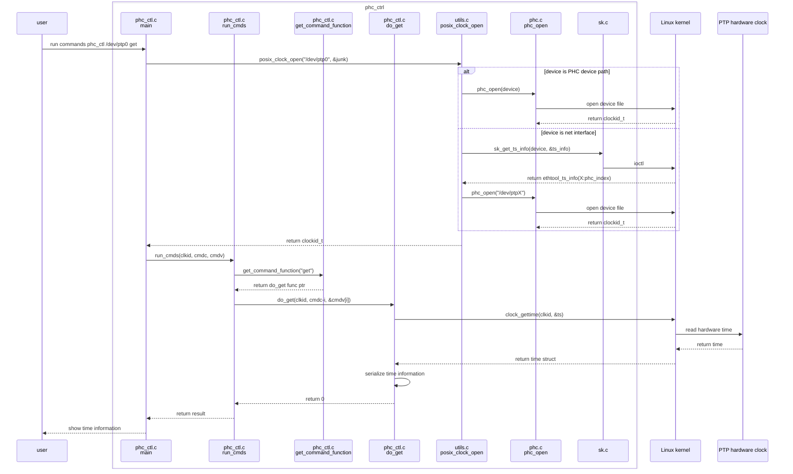

## 1 前言

linuxptp 是linux平台上根据IEEE standard 1588的一个Precision Time Protocol (PTP)协议实现.
更多的特性介绍可以参考页面
[linuxptp feature](https://github.com/richardcochran/linuxptp?tab=readme-ov-file#features)
这里我们尝试从功能和源码的角度进行分析

## 2 源码分析

https://github.com/richardcochran/linuxptp


### 2.1 从phc_ctl看ptp时间查询

```
phc_ctl.c
phc.c
sk.c
utils.c
```




