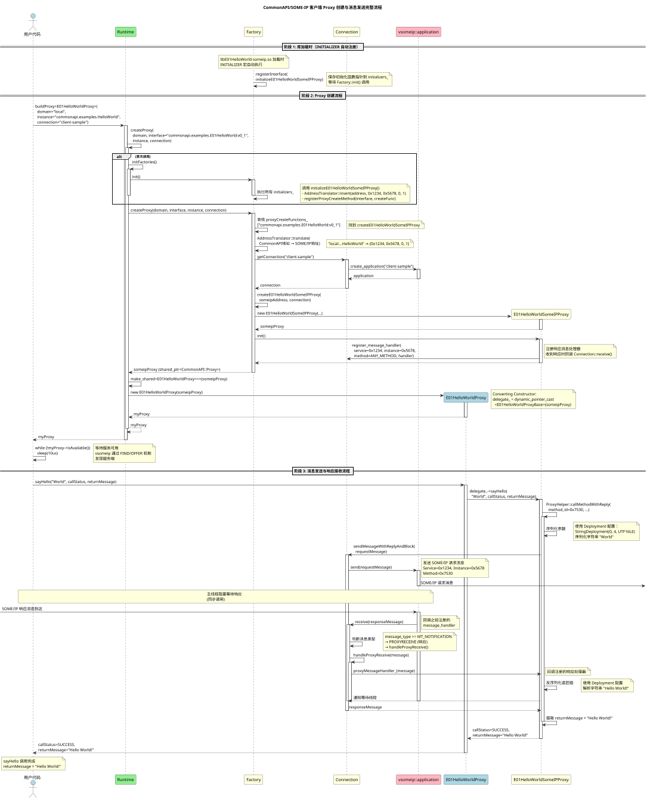

## 1 前言

**vsomeip**是SOME/IP规范的开源实现，作为COVESA项目的一部分设计。同时COVESA开发了**CommonAPI C++**的一套库和工具，方便开发者快速定义和实现IPC/RPC通信接口并基于vsomeip进行符合SOME/IP规范的通信.

本文主要会结合COVESA官方的capicxx-core-tools仓库中的示例01进行分析，介绍接口定义和接口代码实现逻辑


## 2 准备

参考前篇文章"基于vsomeip commonapi的demo" 在本地准备好代码，并至少完成到`./gen.sh`这一步

## 3 分析介绍

### 3.1 代码结构

笔者的代码也包括各个依赖例如`capicxx-core-tools` `capicxx-someip-runtime`, 呈现为如下结构

```
.
├── build
├── capicxx-core-runtime
├── capicxx-core-tools
├── capicxx-someip-runtime
├── CMakeLists.txt -> vsomeip-demo/CMakeLists.txt
├── config
├── envsetup.sh -> vsomeip-demo/scripts/envsetup.sh
├── gen.sh -> vsomeip-demo/scripts/gen.sh
├── googletest
├── prebuilts
│   ├── commonapi_core_generator
│   └── commonapi_someip_generator
├── run.sh -> vsomeip-demo/scripts/run.sh
├── vsomeip
└── vsomeip-demo
```


官方的示例01在 `capicxx-core-tools/CommonAPI-Examples/E01HelloWorld` 路径下，关键目录结构参考

```
capicxx-core-tools/CommonAPI-Examples/E01HelloWorld
├── ...
├── commonapi4someip.ini
├── fidl
│   ├── E01HelloWorld.fidl
│   └── E01HelloWorld-SomeIP.fdepl
├── src
│   ├── E01HelloWorldClient.cpp
│   ├── E01HelloWorldService.cpp
│   ├── E01HelloWorldStubImpl.cpp
│   └── E01HelloWorldStubImpl.hpp
├── src-gen
│   ├── core
│   │   └── v0
│   │       └── commonapi
│   │           └── examples
│   │               ├── E01HelloWorld.hpp
│   │               ├── E01HelloWorldProxyBase.hpp
│   │               ├── E01HelloWorldProxy.hpp
│   │               ├── E01HelloWorldStubDefault.hpp
│   │               └── E01HelloWorldStub.hpp
│   └── someip
│       └── v0
│           └── commonapi
│               └── examples
│                   ├── E01HelloWorldSomeIPCatalog.json
│                   ├── E01HelloWorldSomeIPDeployment.cpp
│                   ├── E01HelloWorldSomeIPDeployment.hpp
│                   ├── E01HelloWorldSomeIPProxy.cpp
│                   ├── E01HelloWorldSomeIPProxy.hpp
│                   ├── E01HelloWorldSomeIPStubAdapter.cpp
│                   └── E01HelloWorldSomeIPStubAdapter.hpp
├── vsomeip-client.json
├── vsomeip-local.json
└── vsomeip-service.json
```

其中大部分文件都是仓库的示例中原始带的，除了两处生成代码目录，通过`./gen.sh`调用`commonapi_core_generator`和`commonapi_someip_generator`生成
- `E01HelloWorld/src-gen/core` 中的代码是`E01HelloWorld.fidl`对应生成
- `E01HelloWorld/src-gen/someip`中的代码是由`E01HelloWorld-SomeIP.fdepl`对应生成

主要实现的业务逻辑则在`E01HelloWorld/src/`目录下


### 3.2 E01HelloWorld Service代码分析

```c++
    // E01HelloWorldService.cpp
    CommonAPI::Runtime::setProperty("LogContext", "E01S");			// for android log or dlt log
    CommonAPI::Runtime::setProperty("LogApplication", "E01S");		// for android log or dlt log
    CommonAPI::Runtime::setProperty("LibraryBase", "E01HelloWorld");

    std::shared_ptr<CommonAPI::Runtime> runtime = CommonAPI::Runtime::get(); // 

    std::string domain = "local"; 							// default value: "local"
    std::string instance = "commonapi.examples.HelloWorld";	// InstanceId in E01HelloWorld-SomeIP.fdepl
    std::string connection = "service-sample";

    std::shared_ptr<E01HelloWorldStubImpl> myService = std::make_shared<E01HelloWorldStubImpl>();
    bool successfullyRegistered = runtime->registerService(domain, instance, myService, connection); // 

    while (!successfullyRegistered) {
        std::cout << "Register Service failed, trying again in 100 milliseconds..." << std::endl;
        std::this_thread::sleep_for(std::chrono::milliseconds(100));
        successfullyRegistered = runtime->registerService(domain, instance, myService, connection);
    }

    std::cout << "Successfully Registered Service!" << std::endl;


```

#### 3.2.1 instance 字段 & fidl/fdepl配置


其中关键的字段`instance`需要和`E01HelloWorld-SomeIP.fdepl`中的`InstanceId`一致

```
define org.genivi.commonapi.someip.deployment for provider as Service {
    instance commonapi.examples.E01HelloWorld {
        InstanceId = "commonapi.examples.HelloWorld"
```


其实本质上是对应到生成代码中的匹配字符串

```c++
// E01HelloWorld/src-gen/someip/v0/commonapi/examples/E01HelloWorldSomeIPStubAdapter.cpp
void initializeE01HelloWorldSomeIPStubAdapter() {
    CommonAPI::SomeIP::AddressTranslator::get()->insert(
        "local:commonapi.examples.E01HelloWorld:v0_1:commonapi.examples.HelloWorld", // 由fdepl文件定义生成的字段
         0x1234, 0x5678, 0, 1);
    CommonAPI::SomeIP::Factory::get()->registerStubAdapterCreateMethod(
        "commonapi.examples.E01HelloWorld:v0_1",
        &createE01HelloWorldSomeIPStubAdapter);
}
```


`E01HelloWorldSomeIPStubAdapter.cpp`中使用的地址字符串和`fidl``fdepl`中定义的完整关系可以参考如下

```
CommonAPI::SomeIP::AddressTranslator::get()->insert(
    "local:commonapi.examples.E01HelloWorld:v0_1:commonapi.examples.HelloWorld",
    // ──┬── ───────┬──────── ──────┬────────── ──┬─ ─────────────┬────────────
    //   │         │                │             │               │
    //   │         │                │             │               └─ fdepl InstanceId
    //   │         │                │             └─ fidl version (0.1)
    //   │         │                └─ fidl interface name
    //   │         └─ fidl package
    //   └─ 默认或代码指定
     0x1234, 0x5678, 0, 1);
    // ────┬─ ────┬─ ─┬ ─┬
    //     │      │   │  └─ minor version (1)
    //     │      │   └─ major version (0)
    //     │      └─ fdepl SomeIpInstanceID (22136)
    //     └─ fdepl SomeIpServiceID (4660)

```


#### 3.2.2 connection 字段 & vsomeip.json配置


```
C++ 用户代码 (E01HelloWorldService.cpp:26)
--------
runtime->registerService(domain, instance, myService, "service-sample")
      ↓
      
CommonAPI::Runtime (Runtime.hpp:116 - template方法)
--------
registerService() 
  → 调用 registerStub(_domain, Stub_::StubInterface::getInterface(), _instance, _service, _connectionId)
      ↓
      
CommonAPI::Runtime (Runtime.cpp)
--------
registerStub(_domain, _interface, _instance, _stub, "service-sample")
  → 调用 registerStubHelper(_domain, _interface, _instance, _stub, "service-sample", false)
      ↓
      
CommonAPI::Runtime (Runtime.cpp)
--------
registerStubHelper(..., "service-sample", _useDefault)
  → 遍历 factories_ map，找到 SomeIP Factory
  → 调用 factory.second->registerStub(_domain, _interface, _instance, _stub, "service-sample")
      ↓
      
CommonAPI::SomeIP::Factory (Factory.cpp)
--------
Factory::registerStub(_domain, _interface, _instance, _stub, "service-sample")
  → 调用 getConnection("service-sample")
      ↓
      
CommonAPI::SomeIP::Factory (Factory.cpp)
--------
Factory::getConnection("service-sample")
  → 查找 connections_ map: connections_.find("service-sample")
  → 如果找到：返回已有的 Connection 对象（复用）
  → 如果未找到：创建新的
      ↓
      
CommonAPI::SomeIP::Factory (Factory.cpp)
--------
new Connection("service-sample")
  → std::make_shared<Connection>("service-sample")
      ↓
      
CommonAPI::SomeIP::Connection (Connection.cpp)
--------
Connection::Connection("service-sample")
  → 初始化成员变量
  → application_ = vsomeip::runtime::get()->create_application("service-sample")
      ↓
      
vsomeip 库 (vsomeip内部实现)
--------
vsomeip::runtime::create_application("service-sample")
  → 读取环境变量 VSOMEIP_CONFIGURATION 指定的配置文件
  → 解析 JSON 配置文件
  → 在 applications[] 数组中查找 name == "service-sample"
      ↓
      
vsomeip-service.json
--------------------
{
    "applications": [
        {
            "name": "service-sample",  ← 必须匹配！
            "id": "0x1277"             ← 使用此 application ID
        }
    ],
    "routing": "service-sample"        ← 此应用作为 routing manager
}
      ↓
      
返回路径
--------
vsomeip::application 对象
  → 返回给 Connection::application_
  → Connection 对象创建完成
  → 存入 Factory::connections_["service-sample"]
  → 用于创建 StubAdapter
  → 注册服务成功
```

对于`E01HelloWorldService`这个vsomeip-commonapi程序来说有两种方式来设定vsomeip application name

1. 使用类似"基于vsomeip commonapi的demo"文章示例代码中的 `VSOMEIP_APPLICATION_NAME=service-sample ./build/bin/E01HelloWorldService`来指定`VSOMEIP_APPLICATION_NAME`参数
2. 另一种就是通过本小节中 `runtime->registerService` 里指定`connection`参数，最终通过各层函数调用变成vsomeip application name

这个name最终会和`vsomeip.json`的对应`application`通过名字来匹配，获取该配置下的例如`id`等信息. 之前的文章"vsomeip clientid分配逻辑"中使用的就是这个id


#### 3.2.3 init func before registerService

```c++
// E01HelloWorldSomeIPStubAdapter.cpp
std::shared_ptr<CommonAPI::SomeIP::StubAdapter> createE01HelloWorldSomeIPStubAdapter(
                   const CommonAPI::SomeIP::Address &_address,
                   const std::shared_ptr<CommonAPI::SomeIP::ProxyConnection> &_connection,
                   const std::shared_ptr<CommonAPI::StubBase> &_stub) {
    return std::make_shared< E01HelloWorldSomeIPStubAdapter<::v0::commonapi::examples::E01HelloWorldStub>>(_address, _connection, _stub);
    // return E01HelloWorldSomeIPStubAdapter
}

void initializeE01HelloWorldSomeIPStubAdapter() {
    CommonAPI::SomeIP::AddressTranslator::get()->insert(
        "local:commonapi.examples.E01HelloWorld:v0_1:commonapi.examples.HelloWorld",
         0x1234, 0x5678, 0, 1);
    // 记录k/v到Factory.stubAdapterCreateFunctions_
    CommonAPI::SomeIP::Factory::get()->registerStubAdapterCreateMethod(
        "commonapi.examples.E01HelloWorld:v0_1",
        &createE01HelloWorldSomeIPStubAdapter);

INITIALIZER(registerE01HelloWorldSomeIPStubAdapter) {
    // 记录到Factory.initializers_
    CommonAPI::SomeIP::Factory::get()->registerInterface(initializeE01HelloWorldSomeIPStubAdapter);
}


void
Factory::registerStubAdapterCreateMethod(
    const std::string &_interface,
    StubAdapterCreateFunction _function) {
    COMMONAPI_INFO("Registering function for creating \"", _interface,
            "\" stub adapter.");
    stubAdapterCreateFunctions_[_interface] = _function;
}

```

#### 3.2.4 INITIALIZER宏和库加载

```c++
INITIALIZER(registerE01HelloWorldSomeIPStubAdapter) {
    CommonAPI::SomeIP::Factory::get()->registerInterface(initializeE01HelloWorldSomeIPStubAdapter);
}

// 宏可以展开为

// 第一行：函数前向声明 + constructor 属性
static void registerE01HelloWorldSomeIPStubAdapter(void) __attribute__((constructor));

// 第二行：函数实现
static void registerE01HelloWorldSomeIPStubAdapter(void) {
    CommonAPI::SomeIP::Factory::get()->registerInterface(initializeE01HelloWorldSomeIPStubAdapter);
}

```


`__attribute__((constructor))` 
- 编译时：编译器将该函数指针记录在 ELF 文件的特殊段（.init_array 或 .ctors）中

- 加载时：动态链接器（ld-linux.so）在加载共享库时会执行：
```
加载 libE01HelloWorld-someip.so
↓
执行 .init_array 段中的所有函数指针
↓
自动调用 registerE01HelloWorldSomeIPStubAdapter()
```

- 执行顺序：
在 main() 函数执行之前（对于可执行文件）
在 dlopen() 返回之前（对于动态加载的共享库）


```c++
// Runtime.cpp
Runtime::registerStub()
{
    initFactories();

    library = getLibrary(_domain, _interface, _instance, false);

    bool libraryLoaded = loadLibrary(library);

}

// 查找需要的库
std::string Runtime::getLibrary(
    const std::string &_domain, 
    const std::string &_interface, 
    const std::string &_instance,
    bool _isProxy) {
    
    std::string address = _domain + ":" + _interface + ":" + _instance;
    
    // 检查属性 "LibraryBase"
    library = getProperty("LibraryBase");
    if (library != "") {
        library = "lib" + library + "-" + defaultBinding_;
        // 结果: "libE01HelloWorld-someip"
    }
    
    return library;
}


bool Runtime::loadLibrary(const std::string &_library) {
    // Linux: 使用 dlopen 加载共享库
    if (dlopen(itsLibrary.c_str(), RTLD_LAZY | RTLD_GLOBAL) != NULL) {
        loadedLibraries_.insert(itsLibrary);
        return true;
    }
}

```
当 libE01HelloWorld-someip.so 被 dlopen 加载时，INITIALIZER 宏自动执行初始化函数


#### 3.2.5 registerService


涉及的关键流程代码

```c++

// E01HelloWorldService.cpp
    std::shared_ptr<E01HelloWorldStubImpl> myService = std::make_shared<E01HelloWorldStubImpl>();
    bool successfullyRegistered = runtime->registerService(domain, instance, myService, connection);
                                                                                // myService --->E01HelloWorldStubImpl


// runtime.hpp
    template<typename Stub_>
    COMMONAPI_METHOD_EXPORT bool registerService(const std::string &_domain,
                         const std::string &_instance,
                         std::shared_ptr<Stub_> _service,
                         const ConnectionId_t &_connectionId = DEFAULT_CONNECTION_ID) {
        return registerStub(_domain, Stub_::StubInterface::getInterface(), _instance, _service, _connectionId); 
                                                                                // _service
    }
    ↓
Runtime::registerStub(const std::string &_domain, const std::string &_interface, const std::string &_instance, std::shared_ptr<StubBase> _stub, std::shared_ptr<MainLoopContext> _context) {// std::shared_ptr<StubBase> _stub = _service;  (隐式转换 E01HelloWorldStubImpl --> StubBase)
    ↓
Runtime::registerStubHelper(...)
    ↓
// Factory.cpp

bool Factory::registerStub(
    const std::string &_domain,
    const std::string &_interface,  // "commonapi.examples.E01HelloWorld:v0_1"
    const std::string &_instance,   // "commonapi.examples.HelloWorld"
    std::shared_ptr<StubBase> _stub, // template<typename Stub_> std::shared_ptr<Stub_> _service
    const ConnectionId_t &_connection) {

    COMMONAPI_INFO("Registering stub for \"", _domain, ":", _interface, ":", _instance, "\"");

    // 【关键】查找在阶段 4 中注册的创建函数
    auto stubAdapterCreateFunctionsIterator = stubAdapterCreateFunctions_.lower_bound(_interface);
    
    if (stubAdapterCreateFunctionsIterator != stubAdapterCreateFunctions_.end()) {
        std::string itsInterface(_interface);
        if (stubAdapterCreateFunctionsIterator->first != _interface) {
            // 版本匹配逻辑...
            std::string itsInterfaceMajor(_interface.substr(0, _interface.find('_')));
            if (stubAdapterCreateFunctionsIterator->first.find(itsInterfaceMajor) != 0)
                return false;
            itsInterface = stubAdapterCreateFunctionsIterator->first;
        }

        // 构造 CommonAPI 地址
        CommonAPI::Address address(_domain, itsInterface, _instance);
        // "local:commonapi.examples.E01HelloWorld:v0_1:commonapi.examples.HelloWorld"
        
        // 地址转换：CommonAPI 地址 → SOME/IP 物理地址
        Address someipAddress;
        AddressTranslator::get()->translate(address, someipAddress);
        // someipAddress = {0x1234, 0x5678, 0, 1}

        // 获取连接
        std::shared_ptr<Connection> itsConnection = getConnection(_connection);
        
        if (itsConnection) {
            // 【关键】调用在阶段 4 中注册的创建函数
            std::shared_ptr<StubAdapter> adapter = stubAdapterCreateFunctionsIterator->second( 
                                                        // 【关键】return E01HelloWorldSomeIPStubAdapter --- CommonAPI someip class
                someipAddress,  // SOME/IP 地址
                itsConnection,  // vsomeip 连接
                _stub           // 用户的 StubImpl       // E01HelloWorldStubImpl --- CommonAPI core class
            );
            // 等价于：createE01HelloWorldSomeIPStubAdapter(someipAddress, itsConnection, _stub)
            
            if (adapter) {
                adapter->registerSelectiveEventHandlers();
                adapter->init(adapter);
                if (registerStubAdapter(adapter))
                    return true;
            }
        }
    }

    COMMONAPI_ERROR("Registering stub for \"", _domain, ":", _interface, ":", _instance, "\" failed!");
    return false;
}


bool
Factory::registerStubAdapter(std::shared_ptr<StubAdapter> _adapter) {
    const std::shared_ptr<ProxyConnection> connection
        = _adapter->getConnection();
    CommonAPI::Address address;
    Address someipAddress = _adapter->getSomeIpAddress();
    if (AddressTranslator::get()->translate(someipAddress, address)) {
        std::lock_guard<std::mutex> itsLock(servicesMutex_);
        const auto &insertResult
            = services_.insert( { address.getAddress(), _adapter } );// 记录k/v(commonapi address/_adapter)到Factory.services_
        const bool &isInsertSuccessful = insertResult.second;

        if (isInsertSuccessful) {
            std::shared_ptr<StubManager> manager
                = connection->getStubManager();
            manager->registerStubAdapter(_adapter);                 // 记录k/v(service,instance/_adapter)到StubManager.registeredStubAdapters_
            return true;
        }
    }

    return false;
}
```

#### 3.2.6 实现类的逻辑

实现类的继承关系

```
E01HelloWorldStubImpl
  ↓ 继承
E01HelloWorldStubDefault
  ↓ virtual 继承
E01HelloWorldStub
  ↓ virtual 继承
CommonAPI::Stub<...>
  ↓ virtual 继承
CommonAPI::StubBase  // 【最顶层基类】
```


实现类的传递逻辑

```
1. 用户代码
   std::shared_ptr<E01HelloWorldStubImpl> myService
   
   ↓ 传递给 registerService
   
2. Runtime::registerService (模板)
   template<typename Stub_>
   std::shared_ptr<Stub_> _service  // Stub_ = E01HelloWorldStubImpl
   
   ↓ 传递给 registerStub
   
3. Runtime::registerStub (非模板)
   std::shared_ptr<StubBase> _stub
   【隐式向上转型：E01HelloWorldStubImpl* → StubBase*】
   
   ↓ 传递给 Factory::registerStub
   
4. Factory::registerStub
   std::shared_ptr<StubBase> _stub
   
   ↓ 传递给 createE01HelloWorldSomeIPStubAdapter
   
5. createE01HelloWorldSomeIPStubAdapter
   std::shared_ptr<StubBase> _stub
   
   ↓ 传递给 StubAdapter 构造函数

6. E01HelloWorldSomeIPStubAdapterInternal 构造函数

    6.1 【父类】调用父类StubAdapterHelper 构造函数
    std::shared_ptr<StubBase> _stub 【保存impl对象指针】
    stub_ = std::dynamic_pointer_cast<StubClass_>(_stub);
    
        ↓ dynamic_pointer_cast
        
        6.1 存储在 stub_ 成员
        std::shared_ptr<E01HelloWorldStub> stub_
        【显式向下转型：StubBase* → E01HelloWorldStub*】
        
        ✓ 指向同一个 E01HelloWorldStubImpl 对象

    6.2 【初始化列表】构造 sayHelloStubDispatcher
    sayHelloStubDispatcher(&E01HelloWorldStub::sayHello, )
        调用 其基础模板类MethodWithReplyStubDispatcher构造
        stubFunctor_(_stubFunctor)
        即stubFunctor_ = &E01HelloWorldStub::sayHello, 
            这里的E01HelloWorldStub对象地址应该已经是6.1中的E01HelloWorldStubImpl对象了
    6.3 【构造函数体】
        addStubDispatcher(0x7530, &sayHelloStubDispatcher)
        └─→ stubDispatcherTable_[0x7530] = &sayHelloStubDispatcher

```

初始化构造完成后的内存


```
════════════════════════════════════════════════════════════════════════════
   E01HelloWorldSomeIPStubAdapterInternal 对象内存视图 
════════════════════════════════════════════════════════════════════════════

【对象1: E01HelloWorldSomeIPStubAdapterInternal】

[继承部分1] CommonAPI::SomeIP::StubAdapter
  • address_    : "local:commonapi.examples.HelloWorld:v0_1"
  • connection_ : shared_ptr<ProxyConnection>

[继承部分2] StubAdapterHelper<E01HelloWorldStub>
  • stub_ : shared_ptr<E01HelloWorldStub>          <-- 6.1
      └─> 指向 0x1234 (E01HelloWorldStubImpl 对象)
  
  • stubDispatcherTable_ : map<method_id, Dispatcher*>
      [0x7530] --> &sayHelloStubDispatcher        <-- 6.3

[继承部分3] enable_shared_from_this
  • weak_this_ : weak_ptr to self

[成员变量1] getE01HelloWorldInterfaceVersionStubDispatcher
  • 用于处理 getInterfaceVersion 属性访问

[成员变量2] sayHelloStubDispatcher : MethodWithReplyStubDispatcher
  • stubFunctor_ : &E01HelloWorldStub::sayHello   <-- 6.2
  
  • stub_ : shared_ptr<E01HelloWorldStub>         <-- 6.1
      └─> 指向 0x1234 (E01HelloWorldStubImpl 对象)

════════════════════════════════════════════════════════════════════════════

                    【两个 stub_ 都指向下面这个对象】
                                   ↓

【对象2: E01HelloWorldStubImpl】 (堆上分配)

[虚函数表指针]
  • vptr --> E01HelloWorldStubImpl 的 vtable
      vtable[sayHello] --> 用户实现代码地址

[继承层次的成员变量]
  • E01HelloWorldStubImpl 的成员 (无额外成员)
  • E01HelloWorldStubDefault 的成员
  • E01HelloWorldStub 的成员
  • CommonAPI::Stub<...> 的成员
  • StubBase 的成员
════════════════════════════════════════════════════════════════════════════

```


#### 3.2.7 总体流程

```
┌─────────────────────────────────────────────────────────────────────────────────┐
│ 阶段 1: 库加载时（dlopen libE01HelloWorld-someip.so）                             │
└─────────────────────────────────────────────────────────────────────────────────┘

Runtime::registerStub -> loadLibrary
1. 动态链接器加载 libE01HelloWorld-someip.so
   ↓
2. 执行 .init_array 段中的 constructor 函数
   ↓
3. INITIALIZER(registerE01HelloWorldSomeIPStubAdapter) 自动执行
   ↓
4. Factory::get()->registerInterface(initializeE01HelloWorldSomeIPStubAdapter)
   ↓
5. isInitialized_ == false → initializers_.push_back(initializeE01HelloWorldSomeIPStubAdapter)  
                                                            // 【记录】initializeE01HelloWorldSomeIPStubAdapter到Factory.initializers_
   ✓ 函数指针已保存，等待调用

┌─────────────────────────────────────────────────────────────────────────────────┐
│ 阶段 2: 用户代码调用 registerService                                              │
└─────────────────────────────────────────────────────────────────────────────────┘

6. runtime->registerService(domain, instance, myService, connection)
   ↓
7. Runtime::registerStub(_domain, "commonapi.examples.E01HelloWorld:v0_1", _instance, ...) // Runtime::registerStub
   ↓
8. if (!isInitialized_) initFactories()  ← 触发初始化
   ↓
9. defaultFactory_->init()  // SOME/IP Factory
   ↓
10. for (auto i : initializers_) i()  // 遍历执行保存的函数
    ↓
11. 【执行】initializeE01HelloWorldSomeIPStubAdapter()                                   
                                                            // 【执行】initializeE01HelloWorldSomeIPStubAdapter
    ├─→ AddressTranslator::insert("local:...HelloWorld", 0x1234, 0x5678, 0, 1)
    │   ✓ 地址映射已注册
    └─→ registerStubAdapterCreateMethod("commonapi.examples.E01HelloWorld:v0_1",        
                                                            // 【记录】createE01HelloWorldSomeIPStubAdapter k/v到Factory.stubAdapterCreateFunctions_
                                        &createE01HelloWorldSomeIPStubAdapter)
        ✓ 创建函数已注册

┌─────────────────────────────────────────────────────────────────────────────────┐
│ 阶段 3: 创建 StubAdapter 实例                                                     │
└─────────────────────────────────────────────────────────────────────────────────┘

12. Runtime::registerStubHelper(...)                        // Runtime::registerStubHelper
    ↓
13. Factory::registerStub(domain, interface, instance, stub, connection) // Factory::registerStubHelper
    ↓
14. auto it = stubAdapterCreateFunctions_.lower_bound("commonapi.examples.E01HelloWorld:v0_1")
    ↓
15. 找到在步骤 11 中注册的创建函数
    ↓
16. AddressTranslator::translate(CommonAPI::Address → SOME/IP Address)
    使用步骤 11 中注册的映射
    ↓
17. adapter = it->second(someipAddress, connection, stub)   // 【执行】stubAdapterCreateFunctions_中存的 createE01HelloWorldSomeIPStubAdapter
    等价于：createE01HelloWorldSomeIPStubAdapter(...)
    ↓
18. 创建 E01HelloWorldSomeIPStubAdapter<E01HelloWorldStub>实例 // 【创建】E01HelloWorldSomeIPStubAdapter (someipAddress, connection, E01HelloWorldStubImpl)
    ↓
19. adapter->registerSelectiveEventHandlers()
    ↓
20. adapter->init(adapter)
    ↓
21. registerStubAdapter(adapter)  // 注册到 services_ 映射表
    ✓ 服务注册完成

```


整个流程体现的特点
- 编译时：编译成独立的共享库 libE01HelloWorld-someip.so
- 运行时：通过 dlopen 动态加载
- 自动注册：INITIALIZER 宏在加载时自动执行注册
- 透明使用：用户代码无需显式 include，通过 Factory 模式自动创建


#### 3.2.8 完整的时序


包括库加载，registerService，实际的业务过程的时序可以参考如下的plantuml

```plantuml
@startuml CommonAPI_SOMEIP_Complete_Flow
scale 0.5
title CommonAPI/SOME-IP 服务注册与消息处理完整流程

!define C_USER #LightBlue
!define C_COMMONAPI #LightGreen
!define C_SOMEIP #LightYellow
!define C_VSOMEIP #LightPink

actor "用户代码" as User #LightBlue
participant "Runtime" as Runtime #LightGreen
participant "Factory" as Factory #LightYellow
participant "StubManager" as StubManager #LightYellow
participant "Connection" as Connection #LightYellow
participant "vsomeip::application" as VsomeIP #LightPink
participant "StubAdapter" as StubAdapter #LightYellow
participant "E01HelloWorldStubImpl" as StubImpl #LightBlue

== 阶段 1: 库加载时（INITIALIZER 自动注册） ==

note over Factory
  libE01HelloWorld-someip.so 加载时
  INITIALIZER 宏自动执行
end note

Factory -> Factory: registerInterface(\ninitializeE01HelloWorldSomeIPStubAdapter)
note right
  保存初始化函数指针到 initializers_
  等待 Factory::init() 调用
end note

== 阶段 2: 服务注册流程 ==

User -> Runtime: registerService(\n  domain="local",\n  instance="commonapi.examples.HelloWorld",\n  myService, connection="service-sample")
activate Runtime

Runtime -> Runtime: registerStub(\n  domain, interface="commonapi.examples.E01HelloWorld:v0_1",\n  instance, stub, connection)
activate Runtime

alt 首次调用
  Runtime -> Runtime: initFactories()
  activate Runtime
  Runtime -> Factory: init()
  activate Factory
  Factory -> Factory: 执行所有 initializers_
  note right
    调用 initializeE01HelloWorldSomeIPStubAdapter()
    - AddressTranslator::insert(address, 0x1234, 0x5678, 0, 1)
    - registerStubAdapterCreateMethod(interface, createFunc)
  end note
  deactivate Factory
  deactivate Runtime
end

Runtime -> Factory: registerStub(domain, interface, instance, stub, connection)
activate Factory

Factory -> Factory: 查找 stubAdapterCreateFunctions_\n["commonapi.examples.E01HelloWorld:v0_1"]
note right
  找到 createE01HelloWorldSomeIPStubAdapter
end note

Factory -> Factory: AddressTranslator::translate(\n  CommonAPI地址 → SOME/IP地址)
note right
  "local:...HelloWorld" → {0x1234, 0x5678, 0, 1}
end note

Factory -> Connection: getConnection("service-sample")
activate Connection
Connection -> VsomeIP: create_application("service-sample")
activate VsomeIP
VsomeIP --> Connection: application
deactivate VsomeIP
Connection --> Factory: connection
deactivate Connection

Factory -> Factory: createE01HelloWorldSomeIPStubAdapter(\n  someipAddress, connection, stub)
create StubAdapter
Factory -> StubAdapter: new E01HelloWorldSomeIPStubAdapter<>(...)
activate StubAdapter
StubAdapter --> Factory: adapter
deactivate StubAdapter

Factory -> StubAdapter: registerSelectiveEventHandlers()
activate StubAdapter
StubAdapter --> Factory
deactivate StubAdapter

Factory -> StubAdapter: init(adapter)
activate StubAdapter
StubAdapter --> Factory
deactivate StubAdapter

Factory -> Factory: registerStubAdapter(adapter)
activate Factory

Factory -> Factory: services_.insert(\n  "local:...HelloWorld", adapter)
note right
  保存 CommonAPI 地址 → Adapter 映射
end note

Factory -> Connection: getStubManager()
activate Connection

alt StubManager 未创建
  create StubManager
  Connection -> StubManager: new StubManager(connection)
  activate StubManager
  StubManager -> Connection: setStubMessageHandler(\n  &StubManager::handleMessage)
  note right
    设置消息处理回调函数
  end note
  Connection --> StubManager
  deactivate StubManager
end

Connection --> Factory: stubManager
deactivate Connection

Factory -> StubManager: registerStubAdapter(adapter)
activate StubManager

StubManager -> StubAdapter: getSomeIpAddress()
activate StubAdapter
StubAdapter --> StubManager: {0x1234, 0x5678, 0, 1}
deactivate StubAdapter

StubManager -> StubManager: registeredStubAdapters_\n[0x1234][0x5678] = adapter
note right
  保存 Service/Instance ID → Adapter 映射
end note

StubManager -> Connection: registerService({0x1234, 0x5678, 0, 1})
activate Connection

Connection -> Connection: 创建消息处理回调\nhandler = bind(&Connection::receive, ...)

Connection -> VsomeIP: register_message_handler(\n  service=0x1234, instance=0x5678,\n  method=ANY_METHOD, handler)
activate VsomeIP
note right
  注册消息处理器：
  当收到匹配的消息时，
  vsomeip 会调用 Connection::receive()
end note
VsomeIP --> Connection
deactivate VsomeIP

Connection -> VsomeIP: offer_service(\n  service=0x1234, instance=0x5678,\n  major=0, minor=1)
activate VsomeIP
note right
  对外提供服务
  在网络上广播 OFFER 消息
end note
VsomeIP --> Connection
deactivate VsomeIP

Connection --> StubManager
deactivate Connection

StubManager --> Factory
deactivate StubManager

Factory --> Factory: true
deactivate Factory

Factory --> Runtime: true
deactivate Factory

Runtime --> Runtime: true
deactivate Runtime

Runtime --> User: true (注册成功)
deactivate Runtime

User -> User: while(true) { sleep(60s); }
note right
  主线程保持运行
  等待客户端请求
end note

== 阶段 3: 消息接收与处理流程 ==

[-> VsomeIP: SOME/IP 请求消息到达\n(Service=0x1234, Instance=0x5678,\nMethod=0x7530)
activate VsomeIP

VsomeIP -> VsomeIP: 查找 message_handler
note right
  根据 service/instance/method
  找到注册的 handler
end note

VsomeIP -> Connection: receive(message)
activate Connection
note right
  回调之前注册的
  message_handler
end note

Connection -> Connection: 判断消息类型
note right
  message_type < MT_NOTIFICATION
  → STUBRECEIVE (请求)
  → handleStubReceive()
  
  message_type >= MT_NOTIFICATION
  → PROXYRECEIVE (响应)
  → handleProxyReceive()
end note

Connection -> Connection: handleStubReceive(message)
activate Connection

Connection -> StubManager: stubMessageHandler_(message)
activate StubManager
note right
  调用之前设置的回调：
  StubManager::handleMessage
end note

StubManager -> StubManager: 根据 Service ID (0x1234)\n和 Instance ID (0x5678)\n查找 StubAdapter
note right
  从 registeredStubAdapters_
  查找对应的 adapter
end note

StubManager -> StubAdapter: onInterfaceMessage(message)
activate StubAdapter

StubAdapter -> StubAdapter: 根据 Method ID (0x7530)\n查找 dispatcher
note right
  从 stubDispatcherTable_
  查找 sayHelloStubDispatcher
end note

StubAdapter -> StubAdapter: sayHelloStubDispatcher(message)
activate StubAdapter

StubAdapter -> StubAdapter: 反序列化参数
note right
  使用 Deployment 配置：
  StringDeployment(0, 4, UTF16LE)
  
  从消息中提取：
  - ClientId
  - name = "World"
end note

StubAdapter -> StubImpl: sayHello(\n  clientId, "World", replyCallback)
activate StubImpl

note over StubImpl
  业务逻辑处理
  string message = "Hello " + name + "!"
  message = "Hello World!"
end note

StubImpl -> StubAdapter: replyCallback("Hello World!")
note right
  调用 reply 回调函数
end note
deactivate StubImpl

StubAdapter -> StubAdapter: 序列化返回值
note right
  使用 Deployment 配置
  序列化字符串 "Hello World!"
end note

StubAdapter -> Connection: send(responseMessage)
activate Connection

Connection -> VsomeIP: send(responseMessage)
activate VsomeIP
note right
  发送 SOME/IP 响应消息
  返回给客户端
end note
VsomeIP --> Connection
deactivate VsomeIP

Connection --> StubAdapter
deactivate Connection

StubAdapter --> StubAdapter: true
deactivate StubAdapter

StubAdapter --> StubManager: true
deactivate StubAdapter

StubManager --> Connection: true
deactivate StubManager

Connection --> Connection
deactivate Connection

Connection --> VsomeIP
deactivate Connection

VsomeIP ->]: SOME/IP 响应消息
deactivate VsomeIP

note over User, VsomeIP
  一次完整的请求-响应处理完成
  系统继续等待下一次请求
end note

@enduml

```




### 3.3 E01HelloWorld Client代码分析

```c++
    // E01HelloWorldClient.cpp
    CommonAPI::Runtime::setProperty("LogContext", "E01C");         // for android log or dlt log
    CommonAPI::Runtime::setProperty("LogApplication", "E01C");     // for android log or dlt log
    CommonAPI::Runtime::setProperty("LibraryBase", "E01HelloWorld");

    std::shared_ptr<CommonAPI::Runtime> runtime = CommonAPI::Runtime::get();

    std::string domain = "local";                               // default value: "local"
    std::string instance = "commonapi.examples.HelloWorld";     // InstanceId in E01HelloWorld-SomeIP.fdepl
    std::string connection = "client-sample";

    std::shared_ptr<E01HelloWorldProxy<>> myProxy = runtime->buildProxy<E01HelloWorldProxy>(domain,
            instance, connection);

    std::cout << "Checking availability!" << std::endl;
    while (!myProxy->isAvailable())
        std::this_thread::sleep_for(std::chrono::microseconds(10));
    std::cout << "Available..." << std::endl;

    const std::string name = "World";
    CommonAPI::CallStatus callStatus;
    std::string returnMessage;

    myProxy->sayHello(name, callStatus, returnMessage, &info);
```

#### 3.3.1 instance 字段 & fidl/fdepl配置

Client 端的 `instance` 字段同样需要和 `E01HelloWorld-SomeIP.fdepl` 中的 `InstanceId` 一致，因为 Client 和 Service 要连接到同一个服务实例。

```
define org.genivi.commonapi.someip.deployment for provider as Service {
    instance commonapi.examples.E01HelloWorld {
        InstanceId = "commonapi.examples.HelloWorld"
```

Client 端生成代码中的地址映射和 Service 端完全相同：

```c++
// E01HelloWorld/src-gen/someip/v0/commonapi/examples/E01HelloWorldSomeIPProxy.cpp
void initializeE01HelloWorldSomeIPProxy() {
    CommonAPI::SomeIP::AddressTranslator::get()->insert(
        "local:commonapi.examples.E01HelloWorld:v0_1:commonapi.examples.HelloWorld", // 由fdepl文件定义生成的字段
         0x1234, 0x5678, 0, 1);
    CommonAPI::SomeIP::Factory::get()->registerProxyCreateMethod(
        "commonapi.examples.E01HelloWorld:v0_1",
        &createE01HelloWorldSomeIPProxy);
}
```

Client 和 Service 使用相同的地址映射关系确保它们能够正确通信：

```
CommonAPI::SomeIP::AddressTranslator::get()->insert(
    "local:commonapi.examples.E01HelloWorld:v0_1:commonapi.examples.HelloWorld",
    // ──┬── ───────┬──────── ──────┬────────── ──┬─ ─────────────┬────────────
    //   │         │                │             │               │
    //   │         │                │             │               └─ fdepl InstanceId (Client 和 Service 必须匹配)
    //   │         │                │             └─ fidl version (0.1)
    //   │         │                └─ fidl interface name
    //   │         └─ fidl package
    //   └─ 默认或代码指定
     0x1234, 0x5678, 0, 1);
    // ────┬─ ────┬─ ─┬ ─┬
    //     │      │   │  └─ minor version (1)
    //     │      │   └─ major version (0)
    //     │      └─ fdepl SomeIpInstanceID (22136) - 必须和 Service 端相同
    //     └─ fdepl SomeIpServiceID (4660) - 必须和 Service 端相同
```

**关键点：**
- Client 和 Service 的 `instance` 字段必须完全一致
- 生成代码中的 Service ID (0x1234) 和 Instance ID (0x5678) 必须相同
- 这样 Client 才能找到并连接到正确的 Service 实例


#### 3.3.2 connection 字段 & vsomeip.json配置

Client 端的 `connection` 参数和 Service 端类似，最终会作为 vsomeip application name 使用：

```
C++ 用户代码 (E01HelloWorldClient.cpp)
--------
runtime->buildProxy<E01HelloWorldProxy>(domain, instance, "client-sample")
      ↓

CommonAPI::Runtime (Runtime.hpp - template方法)
--------
buildProxy()
  → 调用 createProxy(_domain, _instance, _connectionId)
      ↓

CommonAPI::Runtime (Runtime.cpp)
--------
createProxy(_domain, _instance, "client-sample")
  → 调用 createProxyHelper(_domain, _interface, _instance, "client-sample", false)
      ↓

CommonAPI::Runtime (Runtime.cpp)
--------
createProxyHelper(..., "client-sample", _useDefault)
  → 遍历 factories_ map，找到 SomeIP Factory
  → 调用 factory.second->createProxy(_domain, _interface, _instance, "client-sample")
      ↓

CommonAPI::SomeIP::Factory (Factory.cpp)
--------
Factory::createProxy(_domain, _interface, _instance, "client-sample")
  → 调用 getConnection("client-sample")
      ↓

CommonAPI::SomeIP::Factory (Factory.cpp)
--------
Factory::getConnection("client-sample")
  → 查找 connections_ map: connections_.find("client-sample")
  → 如果找到：返回已有的 Connection 对象（复用）
  → 如果未找到：创建新的
      ↓

CommonAPI::SomeIP::Factory (Factory.cpp)
--------
new Connection("client-sample")
  → std::make_shared<Connection>("client-sample")
      ↓

CommonAPI::SomeIP::Connection (Connection.cpp)
--------
Connection::Connection("client-sample")
  → 初始化成员变量
  → application_ = vsomeip::runtime::get()->create_application("client-sample")
      ↓

vsomeip 库 (vsomeip内部实现)
--------
vsomeip::runtime::create_application("client-sample")
  → 读取环境变量 VSOMEIP_CONFIGURATION 指定的配置文件
  → 解析 JSON 配置文件
  → 在 applications[] 数组中查找 name == "client-sample"
      ↓

vsomeip-client.json
--------------------
{
    "applications": [
        {
            "name": "client-sample",  ← 必须匹配！
            "id": "0x1343"            ← 使用此 application ID
        }
    ]
}
      ↓

返回路径
--------
vsomeip::application 对象
  → 返回给 Connection::application_
  → Connection 对象创建完成
  → 存入 Factory::connections_["client-sample"]
  → 用于创建 Proxy
  → 代理创建成功
```

对于 `E01HelloWorldClient` 这个 vsomeip-commonapi 程序来说，同样有两种方式来设定 vsomeip application name：

1. 使用环境变量：`VSOMEIP_APPLICATION_NAME=client-sample ./build/bin/E01HelloWorldClient`
2. 通过 `runtime->buildProxy` 里指定 `connection` 参数

这个 name 最终会和 `vsomeip-client.json` 的对应 `application` 通过名字来匹配，获取该配置下的 `id` 等信息。

**重要差异：**
- Service 端使用 `registerService()` + `connection` 参数
- Client 端使用 `buildProxy()` + `connection` 参数
- 两者都最终调用 `Factory::getConnection()` 创建或复用 Connection 对象
- Service 和 Client 的 connection name 可以不同（通常也应该不同）


#### 3.3.3 init func before buildProxy

Client 端的初始化函数结构与 Service 端类似，但注册的是 Proxy 创建函数：

```c++
// E01HelloWorldSomeIPProxy.cpp

std::shared_ptr<CommonAPI::SomeIP::Proxy> createE01HelloWorldSomeIPProxy(
    const CommonAPI::SomeIP::Address &_address,
    const std::shared_ptr<CommonAPI::SomeIP::ProxyConnection> &_connection) {
    return std::make_shared<E01HelloWorldSomeIPProxy>(_address, _connection);
    // return E01HelloWorldSomeIPProxy
}

void initializeE01HelloWorldSomeIPProxy() {
    CommonAPI::SomeIP::AddressTranslator::get()->insert(
        "local:commonapi.examples.E01HelloWorld:v0_1:commonapi.examples.HelloWorld",
         0x1234, 0x5678, 0, 1);

    // 记录 k/v 到 Factory.proxyCreateFunctions_
    CommonAPI::SomeIP::Factory::get()->registerProxyCreateMethod(
        "commonapi.examples.E01HelloWorld:v0_1",
        &createE01HelloWorldSomeIPProxy);
}

INITIALIZER(registerE01HelloWorldSomeIPProxy) {
    // 记录到 Factory.initializers_
    CommonAPI::SomeIP::Factory::get()->registerInterface(initializeE01HelloWorldSomeIPProxy);
}
```

对应的 Factory 注册方法：

```c++
void Factory::registerProxyCreateMethod(
    const std::string &_interface,
    ProxyCreateFunction _function) {
    COMMONAPI_INFO("Registering function for creating \"", _interface,
            "\" proxy.");
    proxyCreateFunctions_[_interface] = _function;
}
```

**Client 端与 Service 端的差异：**

| 项目 | Service 端 | Client 端 |
|------|-----------|-----------|
| 创建函数名 | `createE01HelloWorldSomeIPStubAdapter` | `createE01HelloWorldSomeIPProxy` |
| 返回类型 | `shared_ptr<StubAdapter>` | `shared_ptr<Proxy>` |
| 注册方法 | `registerStubAdapterCreateMethod()` | `registerProxyCreateMethod()` |
| 存储位置 | `Factory.stubAdapterCreateFunctions_` | `Factory.proxyCreateFunctions_` |
| INITIALIZER 名称 | `registerE01HelloWorldSomeIPStubAdapter` | `registerE01HelloWorldSomeIPProxy` |

两者的地址映射完全相同（0x1234, 0x5678），确保 Client 和 Service 能够正确匹配。


#### 3.3.4 INITIALIZER宏和库加载

Client 端的 INITIALIZER 宏机制与 Service 端完全相同：

```c++
INITIALIZER(registerE01HelloWorldSomeIPProxy) {
    CommonAPI::SomeIP::Factory::get()->registerInterface(initializeE01HelloWorldSomeIPProxy);
}

// 宏可以展开为

// 第一行：函数前向声明 + constructor 属性
static void registerE01HelloWorldSomeIPProxy(void) __attribute__((constructor));

// 第二行：函数实现
static void registerE01HelloWorldSomeIPProxy(void) {
    CommonAPI::SomeIP::Factory::get()->registerInterface(initializeE01HelloWorldSomeIPProxy);
}
```

`__attribute__((constructor))` 的执行时机：

- **编译时**：编译器将该函数指针记录在 ELF 文件的特殊段（.init_array 或 .ctors）中

- **加载时**：动态链接器（ld-linux.so）在加载共享库时会执行：
```
加载 libE01HelloWorld-someip.so
↓
执行 .init_array 段中的所有函数指针
↓
自动调用 registerE01HelloWorldSomeIPProxy()
```

- **执行顺序**：
  - 在 main() 函数执行之前（对于可执行文件）
  - 在 dlopen() 返回之前（对于动态加载的共享库）

库加载流程：

```c++
// Runtime.cpp
Runtime::createProxy()
{
    initFactories();

    library = getLibrary(_domain, _interface, _instance, true);  // true 表示是 Proxy

    bool libraryLoaded = loadLibrary(library);
}

// 查找需要的库
std::string Runtime::getLibrary(
    const std::string &_domain,
    const std::string &_interface,
    const std::string &_instance,
    bool _isProxy) {  // Client 端传入 true

    std::string address = _domain + ":" + _interface + ":" + _instance;

    // 检查属性 "LibraryBase"
    library = getProperty("LibraryBase");
    if (library != "") {
        library = "lib" + library + "-" + defaultBinding_;
        // 结果: "libE01HelloWorld-someip"
    }

    return library;
}

bool Runtime::loadLibrary(const std::string &_library) {
    // Linux: 使用 dlopen 加载共享库
    if (dlopen(itsLibrary.c_str(), RTLD_LAZY | RTLD_GLOBAL) != NULL) {
        loadedLibraries_.insert(itsLibrary);
        return true;
    }
}
```

当 `libE01HelloWorld-someip.so` 被 dlopen 加载时，INITIALIZER 宏自动执行初始化函数。

**关键点：**
- Client 和 Service 端共享同一个 `libE01HelloWorld-someip.so` 库
- 该库包含了 Proxy 和 StubAdapter 的注册代码
- INITIALIZER 宏确保两者的创建函数都被自动注册
- 无论是 Client 还是 Service 端调用，库只会加载一次


#### 3.3.5 buildProxy

涉及的关键流程代码：

```c++
// E01HelloWorldClient.cpp
    std::shared_ptr<E01HelloWorldProxy<>> myProxy = runtime->buildProxy<E01HelloWorldProxy>(domain,
            instance, connection);
                                                                        // E01HelloWorldProxy 是模板参数

// Runtime.hpp
    template<template<typename ...> class Proxy_, typename ... AttributeExtensions_>
    COMMONAPI_METHOD_EXPORT std::shared_ptr<Proxy_<AttributeExtensions_...>>
    buildProxy(const std::string &_domain,
               const std::string &_instance,
               const ConnectionId_t &_connectionId = DEFAULT_CONNECTION_ID) {
        return std::dynamic_pointer_cast<Proxy_<AttributeExtensions_...>>(
            createProxy(_domain, Proxy_<AttributeExtensions_...>::getInterface(), _instance, _connectionId));
                                                                        // 调用 createProxy
    }
    ↓
Runtime::createProxy(const std::string &_domain, const std::string &_interface, const std::string &_instance, const ConnectionId_t &_connectionId) {
    ↓
Runtime::createProxyHelper(...)
    ↓
// Factory.cpp

std::shared_ptr<CommonAPI::Proxy>
Factory::createProxy(
    const std::string &_domain,
    const std::string &_interface,  // "commonapi.examples.E01HelloWorld:v0_1"
    const std::string &_instance,   // "commonapi.examples.HelloWorld"
    const ConnectionId_t &_connectionId) {

    COMMONAPI_VERBOSE("Creating proxy for \"", _domain, ":", _interface, ":", _instance, "\"");

    // 【关键】查找在阶段 4 中注册的创建函数
    auto proxyCreateFunctionsIterator = proxyCreateFunctions_.lower_bound(_interface);

    if (proxyCreateFunctionsIterator != proxyCreateFunctions_.end()) {
        std::string itsInterface(_interface);
        if (proxyCreateFunctionsIterator->first != _interface) {
            // 版本匹配逻辑...
            std::string itsInterfaceMajor(_interface.substr(0, _interface.find('_')));
            if (proxyCreateFunctionsIterator->first.find(itsInterfaceMajor) != 0)
                return nullptr;
            itsInterface = proxyCreateFunctionsIterator->first;
        }

        // 构造 CommonAPI 地址
        CommonAPI::Address address(_domain, itsInterface, _instance);
        // "local:commonapi.examples.E01HelloWorld:v0_1:commonapi.examples.HelloWorld"

        // 地址转换：CommonAPI 地址 → SOME/IP 物理地址
        Address someipAddress;
        AddressTranslator::get()->translate(address, someipAddress);
        // someipAddress = {0x1234, 0x5678, 0, 1}

        // 获取连接
        std::shared_ptr<Connection> itsConnection = getConnection(_connectionId);

        if (itsConnection) {
            // 【关键】调用在阶段 4 中注册的创建函数
            std::shared_ptr<Proxy> proxy = proxyCreateFunctionsIterator->second(
                                                        // 【关键】return E01HelloWorldSomeIPProxy
                someipAddress,  // SOME/IP 地址
                itsConnection   // vsomeip 连接
            );
            // 等价于：createE01HelloWorldSomeIPProxy(someipAddress, itsConnection)

            if (proxy && proxy->init())
                return proxy;
        }
    }

    COMMONAPI_ERROR("Creating proxy for \"", _domain, ":", _interface, ":", _instance, "\" failed!");
    return nullptr;
}
```

**与 Service 端 registerService 的对比：**

| 步骤 | Service 端 (registerService) | Client 端 (buildProxy) |
|------|------------------------------|------------------------|
| 1. 查找创建函数 | `stubAdapterCreateFunctions_.lower_bound()` | `proxyCreateFunctions_.lower_bound()` |
| 2. 地址转换 | CommonAPI 地址 → SOME/IP 地址 | CommonAPI 地址 → SOME/IP 地址 |
| 3. 获取连接 | `getConnection(_connection)` | `getConnection(_connectionId)` |
| 4. 调用创建函数 | `createE01HelloWorldSomeIPStubAdapter()` | `createE01HelloWorldSomeIPProxy()` |
| 5. 返回对象 | 存为内部成员`<str,shared_ptr<StubAdapter>> Factory::services_` | `shared_ptr<Proxy>` |
| 6. 初始化 | `adapter->init()` | `proxy->init()` |
| 7. 注册 | `registerStubAdapter(adapter)` 注册到 services_ | 不需要额外注册，直接返回 |

**关键差异：**
- Service 端需要调用 `registerStubAdapter()` 将 adapter 注册到 `Factory.services_` 和 `StubManager.registeredStubAdapters_`
- Client 端创建完 Proxy 后直接返回给用户使用，不需要注册到全局管理器
- Service 端需要向 vsomeip 注册消息处理器和 offer_service
- Client 端只需要 Proxy 对象来发送请求


#### 3.3.6 Proxy类的逻辑

Proxy 类的继承关系：

```
E01HelloWorldProxy<> (用户使用的模板类)
  ↓ virtual 继承
E01HelloWorldProxyBase (生成的抽象基类)
  ↓ virtual 继承
CommonAPI::Proxy  // 【CommonAPI Core 基类】
  ↑
  │ 实际实现类
  ↓
E01HelloWorldSomeIPProxy (SOME/IP 具体实现)
  ↓ virtual 继承
CommonAPI::SomeIP::Proxy  // 【CommonAPI SOME/IP 基类】
```

Proxy 类的创建和传递逻辑：

```
1. 用户代码
   std::shared_ptr<E01HelloWorldProxy<>> myProxy

   ↓ buildProxy 调用

2. Runtime::buildProxy (模板)
   template<template<typename ...> class Proxy_, typename ... AttributeExtensions_>
   std::shared_ptr<Proxy_<AttributeExtensions_...>>
   // Proxy_ = E01HelloWorldProxy

   ↓ 调用 createProxy

3. Runtime::createProxy (非模板)
   std::shared_ptr<CommonAPI::Proxy>
   【向上转型：具体 Proxy → CommonAPI::Proxy】

   ↓ 传递给 Factory::createProxy

4. Factory::createProxy
   std::shared_ptr<CommonAPI::Proxy>
    // 参考3.3.5 函数分析， proxyCreateFunctionsIterator->second(someipAddress, itsConnection)
    // 相当于
   ↓ 调用 createE01HelloWorldSomeIPProxy

5. createE01HelloWorldSomeIPProxy
   return std::make_shared<E01HelloWorldSomeIPProxy>(_address, _connection);
   【创建 SOME/IP 实现类】
    回到buildProxy函数这里返回，并构造E01HelloWorldProxy对象myProxy
    std::shared_ptr<E01HelloWorldProxy<>> myProxy = runtime->buildProxy<E01HelloWorldProxy>
   ↓ 返回

6. E01HelloWorldProxy 构造函数
   E01HelloWorldProxy(std::shared_ptr<CommonAPI::Proxy> delegate):
       delegate_(std::dynamic_pointer_cast<E01HelloWorldProxyBase>(delegate)) {
   }

   【关键】通过 delegate 模式，E01HelloWorldProxy 持有 E01HelloWorldSomeIPProxy
```

Proxy 对象的委托关系：

```
【用户持有的对象】
std::shared_ptr<E01HelloWorldProxy<>>
  │
  │ 成员变量 delegate_
  ↓
【实际实现对象】
std::shared_ptr<E01HelloWorldSomeIPProxy>
  ↓ 继承自
CommonAPI::SomeIP::Proxy
```

方法调用流程：

```
// 用户调用
myProxy->sayHello(name, callStatus, returnMessage, &info);

  ↓ E01HelloWorldProxy::sayHello (inline 模板方法)

// E01HelloWorldProxy.hpp:118
delegate_->sayHello(_name, _internalCallStatus, _message, _info);

  ↓ 调用实际实现

// E01HelloWorldSomeIPProxy::sayHello
void E01HelloWorldSomeIPProxy::sayHello(...) {
    // 序列化参数
    CommonAPI::Deployable<std::string, ...> deploy_name(_name, ...);

    // 调用 ProxyHelper 发送 SOME/IP 消息
    CommonAPI::SomeIP::ProxyHelper<...>::callMethodWithReply(
        *this,
        CommonAPI::SomeIP::method_id_t(0x7530),  // Method ID
        true,   // reliable
        false,  // not selective
        _info,
        deploy_name,
        _internalCallStatus,
        deploy_message);

    _message = deploy_message.getValue();
}
```

**Proxy 设计模式分析：**

1. **委托模式 (Delegate Pattern)**：
   - `E01HelloWorldProxy` 不直接实现功能
   - 通过 `delegate_` 成员委托给 `E01HelloWorldSomeIPProxy`
   - 实现了接口与实现的分离

2. **模板与类型擦除**：
   - `E01HelloWorldProxy<>` 是模板类，支持属性扩展
   - `createProxy` 返回 `shared_ptr<CommonAPI::Proxy>`（类型擦除）
   - `buildProxy` 通过 `dynamic_pointer_cast` 恢复具体类型

3. **虚继承 (Virtual Inheritance)**：
   - 避免菱形继承问题
   - `E01HelloWorldProxy` 和 `E01HelloWorldSomeIPProxy` 都继承自 `CommonAPI::Proxy`
   - 确保只有一个 `CommonAPI::Proxy` 基类实例

**与 Service 端 Stub 的对比：**

| 项目 | Service 端 (Stub) | Client 端 (Proxy) |
|------|-------------------|-------------------|
| 用户类 | `E01HelloWorldStubImpl` | `E01HelloWorldProxy<>` |
| 生成的基类 | `E01HelloWorldStubDefault` | `E01HelloWorldProxyBase` |
| SOME/IP 实现 | `E01HelloWorldSomeIPStubAdapter` | `E01HelloWorldSomeIPProxy` |
| 关系 | 继承关系（Impl 继承 Default） | 委托关系（Proxy 持有 SomeIPProxy） |
| 用户代码 | 重写虚函数实现业务逻辑 | 调用方法发送请求 |
| 方向 | 接收消息，调用用户实现 | 发送消息到服务端 |


#### 3.3.7 总体流程

```
┌─────────────────────────────────────────────────────────────────────────────────┐
│ 阶段 1: 库加载时（dlopen libE01HelloWorld-someip.so）                             │
└─────────────────────────────────────────────────────────────────────────────────┘

Runtime::createProxy -> loadLibrary
1. 动态链接器加载 libE01HelloWorld-someip.so
   ↓
2. 执行 .init_array 段中的 constructor 函数
   ↓
3. INITIALIZER(registerE01HelloWorldSomeIPProxy) 自动执行
   ↓
4. Factory::get()->registerInterface(initializeE01HelloWorldSomeIPProxy)
   ↓
5. isInitialized_ == false → initializers_.push_back(initializeE01HelloWorldSomeIPProxy)
                                                            // 【记录】initializeE01HelloWorldSomeIPProxy到Factory.initializers_
   ✓ 函数指针已保存，等待调用

┌─────────────────────────────────────────────────────────────────────────────────┐
│ 阶段 2: 用户代码调用 buildProxy                                                    │
└─────────────────────────────────────────────────────────────────────────────────┘

6. runtime->buildProxy<E01HelloWorldProxy>(domain, instance, connection)
   ↓
7. Runtime::createProxy(_domain, "commonapi.examples.E01HelloWorld:v0_1", _instance, ...) // Runtime::createProxy
   ↓
8. if (!isInitialized_) initFactories()  ← 触发初始化
   ↓
9. defaultFactory_->init()  // SOME/IP Factory
   ↓
10. for (auto i : initializers_) i()  // 遍历执行保存的函数
    ↓
11. 【执行】initializeE01HelloWorldSomeIPProxy()
                                                            // 【执行】initializeE01HelloWorldSomeIPProxy
    ├─→ AddressTranslator::insert("local:...HelloWorld", 0x1234, 0x5678, 0, 1)
    │   ✓ 地址映射已注册
    └─→ registerProxyCreateMethod("commonapi.examples.E01HelloWorld:v0_1",
                                                            // 【记录】createE01HelloWorldSomeIPProxy k/v到Factory.proxyCreateFunctions_
                                        &createE01HelloWorldSomeIPProxy)
        ✓ 创建函数已注册

┌─────────────────────────────────────────────────────────────────────────────────┐
│ 阶段 3: 创建 Proxy 实例                                                           │
└─────────────────────────────────────────────────────────────────────────────────┘

12. Runtime::createProxyHelper(...)                        // Runtime::createProxyHelper
    ↓
13. Factory::createProxy(domain, interface, instance, connection) // Factory::createProxy
    ↓
14. auto it = proxyCreateFunctions_.lower_bound("commonapi.examples.E01HelloWorld:v0_1")
    ↓
15. 找到在步骤 11 中注册的创建函数
    ↓
16. AddressTranslator::translate(CommonAPI::Address → SOME/IP Address)
    使用步骤 11 中注册的映射
    ↓
17. proxy = it->second(someipAddress, connection)   // 【执行】proxyCreateFunctions_中存的 createE01HelloWorldSomeIPProxy
    等价于：createE01HelloWorldSomeIPProxy(...)
    ↓
18. 创建 E01HelloWorldSomeIPProxy 实例 // 【创建】E01HelloWorldSomeIPProxy (someipAddress, connection)
    ↓
19. proxy->init()
    ↓
20. return proxy (返回 shared_ptr<CommonAPI::SomeIP::Proxy>)
    ↓
21. std::make_shared<E01HelloWorldProxy<>>(proxy)  // 【创建】E01HelloWorldProxy 包装对象
    ↓
22. E01HelloWorldProxy 构造函数初始化 delegate_ = E01HelloWorldSomeIPProxy
    ✓ Proxy 创建完成
    ↓
23. return myProxy (返回给用户代码)

```


整个流程体现的特点：
- 编译时：Client 和 Service 共享同一个共享库 libE01HelloWorld-someip.so
- 运行时：通过 dlopen 动态加载
- 自动注册：INITIALIZER 宏在加载时自动执行注册（Proxy 和 StubAdapter 都注册）
- 透明使用：用户代码无需显式 include，通过 Factory 模式自动创建
- 委托模式：E01HelloWorldProxy 通过 delegate_ 委托给 E01HelloWorldSomeIPProxy 实现


**与 Service 端流程的对比：**

| 步骤 | Service 端 | Client 端 |
|------|-----------|-----------|
| 库加载 | INITIALIZER(registerE01HelloWorldSomeIPStubAdapter) | INITIALIZER(registerE01HelloWorldSomeIPProxy) |
| 用户调用 | `runtime->registerService()` | `runtime->buildProxy()` |
| 初始化函数 | `initializeE01HelloWorldSomeIPStubAdapter()` | `initializeE01HelloWorldSomeIPProxy()` |
| 注册方法 | `registerStubAdapterCreateMethod()` | `registerProxyCreateMethod()` |
| 存储位置 | `Factory.stubAdapterCreateFunctions_` | `Factory.proxyCreateFunctions_` |
| 创建函数 | `createE01HelloWorldSomeIPStubAdapter()` | `createE01HelloWorldSomeIPProxy()` |
| 创建对象 | `E01HelloWorldSomeIPStubAdapter` | `E01HelloWorldSomeIPProxy` |
| 额外包装 | 无（用户直接继承 StubDefault） | `E01HelloWorldProxy`（委托模式） |
| 注册到管理器 | `registerStubAdapter()` 注册到 services_ | 不需要（直接返回给用户） |
| 后续操作 | `offer_service()` 对外提供服务 | 无需 offer（作为客户端） |

**关键差异说明：**

1. **共享库加载**：
   - Client 和 Service 都加载 `libE01HelloWorld-someip.so`
   - 该库包含 Proxy 和 StubAdapter 的注册代码
   - INITIALIZER 宏确保两者都被自动注册

2. **创建流程**：
   - Service 端：`registerService` → 创建 StubAdapter → 注册到全局管理器 → offer_service
   - Client 端：`buildProxy` → 创建 SomeIPProxy → 包装到 Proxy → 直接返回

3. **对象管理**：
   - Service 端：StubAdapter 被注册到 `Factory.services_` 和 `StubManager.registeredStubAdapters_`
   - Client 端：Proxy 对象直接由用户持有，无需全局注册

4. **通信角色**：
   - Service 端：注册消息处理器，等待接收请求
   - Client 端：持有 Proxy 对象，主动发送请求


#### 3.3.8 完整的时序

包括库加载，buildProxy，实际的业务过程的时序可以参考如下的plantuml



