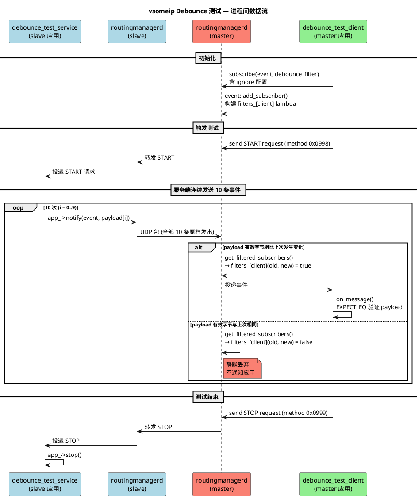
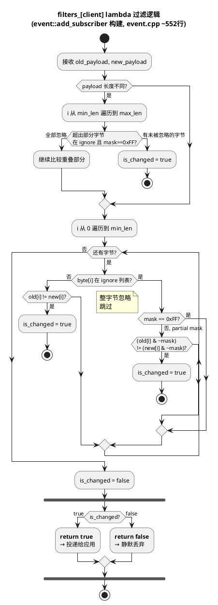

## 1 前言

**vsomeip**是SOME/IP规范的开源实现，作为COVESA项目的一部分设计，其仓库本身包含完善的测试代码.
本文旨在运行vsomeip仓库中的网络测试 `vsomeip/test/network_tests/`


## 2 准备

### 2.1 代码准备

参考前篇文章"基于vsomeip commonapi的demo" 在本地准备好代码.

### 2.2 环境网络配置准备

#### why

vsomeip的一部分server/client测试需要跨网卡. 方式1是使用两台主机, 方式2是在一台主机上启用两个docker容器.

如果当前只有一台机器，还有一个更轻量的方式3，即这里要使用的linux虚拟网络设备


#### how

```bash
# 新建一个网络命名空间 slave_ns
sudo ip netns add slave_ns

# 创建一对虚拟以太网设备（veth pair）
# 一端叫 veth_master，另一端叫 veth_slave. 数据从一端发出会立即从另一端收到
sudo ip link add veth_master type veth peer name veth_slave

# 把veth_slave移动到 slave_ns命名空间中, veth_master保留在了主机的默认命名空间中
sudo ip link set veth_slave netns slave_ns

# 给主机端veth_master 分配ip 192.168.99.1
sudo ip addr add 192.168.99.1/24 dev veth_master
# 启动veth_master
sudo ip link set veth_master up

# 给slave_ns命名空间中的veth_slave 分配ip 192.168.99.2
sudo ip netns exec slave_ns ip addr add 192.168.99.2/24 dev veth_slave
# 启动veth_slave
sudo ip netns exec slave_ns ip link set veth_slave up
```

配置完成后你应该可以查到相关的两个网卡
```bash
ip addr | grep veth_master
7: veth_master@if6: <BROADCAST,MULTICAST,UP,LOWER_UP> mtu 1500 qdisc noqueue state UP group default qlen 1000
    inet 192.168.99.1/24 scope global veth_master


sudo ip netns exec slave_ns ip addr | grep veth_slave
6: veth_slave@if7: <BROADCAST,MULTICAST,UP,LOWER_UP> mtu 1500 qdisc noqueue state UP group default qlen 1000
    inet 192.168.99.2/24 scope global veth_slave
```


## 3 编译代码

我们在`vsomeip/build/`目录下进行编译

```bash
cd vsomeip
mkdir build
cd build
#cmake
cmake .. -DTEST_IP_MASTER=192.168.99.1 -DTEST_IP_SLAVE=192.168.99.2 -DGTEST_ROOT=$(pwd)/../../googletest
#make
make build_network_tests -j$(nproc)
```

## 4 执行测试


在`vsomeip/build`下

更新环境变量

```bash
export LD_LIBRARY_PATH=$(pwd)/:$LD_LIBRARY_PATH
```


查看所有的测试用例

```bash
  ctest -N
  Test   #1: configuration-test
  Test   #2: application_test
  Test   #3: application_test_single_process
  Test   #4: application_test_availability
  Test   #5: magic_cookies_test
  Test   #6: header_factory_test
  Test   #7: header_factory_test_send_receive
  Test   #8: local_routing_test
  Test   #9: external_local_routing_test
  Test  #10: local_payload_test
  Test  #11: local_payload_test_huge_payload
  Test  #12: external_local_payload_test_client_local
  Test  #13: external_local_payload_test_client_external
  Test  #14: external_local_payload_test_client_local_and_external
  Test  #15: big_payload_test_local
  Test  #16: big_payload_test_local_random
  Test  #17: big_payload_test_local_limited
  Test  #18: big_payload_test_local_queue_limited
  Test  #19: big_payload_test_local_tcp
  Test  #20: big_payload_test_local_tcp_random
  Test  #21: big_payload_test_local_tcp_limited
  Test  #22: big_payload_test_local_tcp_queue_limited
  Test  #23: big_payload_test_external
  Test  #24: big_payload_test_external_random
  Test  #25: big_payload_test_external_limited
  Test  #26: big_payload_test_external_limited_general
  Test  #27: big_payload_test_external_queue_limited_general
  Test  #28: big_payload_test_external_queue_limited_specific
  Test  #29: big_payload_test_external_udp
  Test  #30: client_id_test_diff_client_ids_diff_ports
  Test  #31: client_id_test_diff_client_ids_same_ports
  Test  #32: client_id_test_diff_client_ids_partial_same_ports
  Test  #33: client_id_test_utility
  Test  #34: client_id_test_utility_masked_511
  Test  #35: client_id_test_utility_masked_4095
  Test  #36: client_id_test_utility_masked_127
  Test  #37: client_id_test_utility_discontinuous_masked_511
  Test  #38: debounce_test
  Test  #39: debounce_filter_test
  Test  #40: debounce_callback_test
  Test  #41: debounce_frequency_test
  Test  #42: subscribe_notify_test_diff_client_ids_diff_ports_udp_local_tcp
  Test  #43: subscribe_notify_test_diff_client_ids_diff_ports_tcp_local_tcp
  Test  #44: subscribe_notify_test_diff_client_ids_diff_ports_both_tcp_and_udp_local_tcp
  Test  #45: subscribe_notify_test_diff_client_ids_same_ports_udp_local_tcp
  Test  #46: subscribe_notify_test_diff_client_ids_same_ports_tcp_local_tcp
  Test  #47: subscribe_notify_test_diff_client_ids_same_ports_both_tcp_and_udp_local_tcp
  Test  #48: subscribe_notify_test_diff_client_ids_partial_same_ports_both_tcp_and_udp_local_tcp
  Test  #49: subscribe_notify_test_diff_client_ids_diff_ports_same_service_id_udp_local_tcp
  Test  #50: subscribe_notify_test_diff_client_ids_diff_ports_autoconfig_udp_local_tcp
  Test  #51: subscribe_notify_test_one_event_two_eventgroups_udp_local_tcp
  Test  #52: subscribe_notify_test_one_event_two_eventgroups_tcp_local_tcp
  Test  #53: subscribe_notify_test_diff_client_ids_diff_ports_udp
  Test  #54: subscribe_notify_test_diff_client_ids_diff_ports_tcp
  Test  #55: subscribe_notify_test_diff_client_ids_diff_ports_both_tcp_and_udp
  Test  #56: subscribe_notify_test_diff_client_ids_same_ports_udp
  Test  #57: subscribe_notify_test_diff_client_ids_same_ports_tcp
  Test  #58: subscribe_notify_test_diff_client_ids_same_ports_both_tcp_and_udp
  Test  #59: subscribe_notify_test_diff_client_ids_partial_same_ports_both_tcp_and_udp
  Test  #60: subscribe_notify_test_diff_client_ids_diff_ports_same_service_id_udp
  Test  #61: subscribe_notify_test_diff_client_ids_diff_ports_autoconfig_udp
  Test  #62: subscribe_notify_test_one_event_two_eventgroups_udp
  Test  #63: subscribe_notify_test_one_event_two_eventgroups_tcp
  Test  #64: subscribe_notify_one_test_diff_client_ids_diff_ports_udp
  Test  #65: subscribe_notify_one_test_diff_client_ids_diff_ports_tcp
  Test  #66: subscribe_notify_one_test_diff_client_ids_diff_ports_both_tcp_and_udp
  Test  #67: cpu_load_test
  Test  #68: initial_event_test_diff_client_ids_diff_ports_udp
  Test  #69: initial_event_test_diff_client_ids_diff_ports_tcp
  Test  #70: initial_event_test_diff_client_ids_diff_ports_both_tcp_and_udp
  Test  #71: initial_event_test_diff_client_ids_same_ports_udp
  Test  #72: initial_event_test_diff_client_ids_same_ports_tcp
  Test  #73: initial_event_test_diff_client_ids_same_ports_both_tcp_and_udp
  Test  #74: initial_event_test_diff_client_ids_partial_same_ports_both_tcp_and_udp
  Test  #75: initial_event_test_diff_client_ids_diff_ports_same_service_id_udp
  Test  #76: initial_event_test_multiple_events_diff_client_ids_diff_ports_udp
  Test  #77: initial_event_test_multiple_events_diff_client_ids_diff_ports_tcp
  Test  #78: initial_event_test_multiple_events_diff_client_ids_diff_ports_both_tcp_and_udp
  Test  #79: initial_event_test_multiple_events_diff_client_ids_same_ports_udp
  Test  #80: initial_event_test_multiple_events_diff_client_ids_same_ports_tcp
  Test  #81: initial_event_test_multiple_events_diff_client_ids_same_ports_both_tcp_and_udp
  Test  #82: initial_event_test_multiple_events_diff_client_ids_partial_same_ports_both_tcp_and_udp
  Test  #83: initial_event_test_multiple_events_diff_client_ids_diff_ports_same_service_id_udp
  Test  #84: initial_event_test_multiple_events_subscribe_on_availability_diff_client_ids_diff_ports_udp
  Test  #85: initial_event_test_multiple_events_subscribe_on_availability_diff_client_ids_diff_ports_tcp
  Test  #86: initial_event_test_multiple_events_subscribe_on_availability_diff_client_ids_diff_ports_both_tcp_and_udp
  Test  #87: initial_event_test_multiple_events_subscribe_on_availability_diff_client_ids_same_ports_udp
  Test  #88: initial_event_test_multiple_events_subscribe_on_availability_diff_client_ids_same_ports_tcp
  Test  #89: initial_event_test_multiple_events_subscribe_on_availability_diff_client_ids_same_ports_both_tcp_and_udp
  Test  #90: initial_event_test_multiple_events_subscribe_on_availability_diff_client_ids_partial_same_ports_both_tcp_and_udp
  Test  #91: initial_event_test_multiple_events_subscribe_on_availability_diff_client_ids_diff_ports_same_service_id_udp
  Test  #92: initial_event_test_multiple_events_diff_client_ids_diff_ports_partial_subscription_udp
  Test  #93: initial_event_test_multiple_events_diff_client_ids_diff_ports_partial_subscription_tcp
  Test  #94: initial_event_test_multiple_events_diff_client_ids_diff_ports_partial_subscription_both_tcp_and_udp
  Test  #95: initial_event_test_diff_client_ids_same_ports_udp_client_subscribes_twice
  Test  #96: offer_test_local
  Test  #97: offer_test_external
  Test  #98: offer_test_big_sd_msg
  Test  #99: offer_test_multiple_offerings
  Test #100: offered_services_info_test_local
  Test #101: restart_routing_test
  Test #102: pending_subscription_test_subscribe
  Test #103: pending_subscription_test_alternating_subscribe_unsubscribe
  Test #104: pending_subscription_test_unsubscribe
  Test #105: pending_subscription_test_alternating_subscribe_unsubscribe_nack
  Test #106: pending_subscription_test_alternating_subscribe_unsubscribe_same_port
  Test #107: pending_subscription_test_subscribe_resubscribe_mixed
  Test #108: pending_subscription_test_subscribe_stopsubscribe_subscribe
  Test #109: pending_subscription_test_send_request_to_sd_port
  Test #110: malicious_data_test_events
  Test #111: malicious_data_test_protocol_version
  Test #112: malicious_data_test_message_type
  Test #113: malicious_data_test_return_code
  Test #114: malicious_data_test_wrong_header_fields_udp
  Test #115: npdu_test_udp
  Test #116: npdu_test_tcp
  Test #117: e2e_test_external
  Test #118: e2e_profile_04_test_external
  Test #119: e2e_profile_07_test_external
  Test #120: event_test_payload_fixed_udp
  Test #121: event_test_payload_fixed_tcp
  Test #122: event_test_payload_dynamic_udp
  Test #123: event_test_payload_dynamic_tcp
  Test #124: someip_tp_test_in_sequence
  Test #125: someip_tp_test_mixed
  Test #126: someip_tp_test_incomplete
  Test #127: someip_tp_test_duplicate
  Test #128: someip_tp_test_overlap
  Test #129: someip_tp_test_overlap_front_back
  Test #130: suspend_resume_test_initial
  Test #131: internal_routing_disabled_acceptance_test

Total Tests: 131
```


### 普通测试

单独跑一个测试

```bash
ctest -V -R internal_routing_disabled_acceptance_test
```

### 跨网卡测试

对于部分需要跨网卡通信的测试，情况稍微复杂一些

以`debounce_tests`为例

在一个终端shell中的 `vsomeip/build/test/network_tests/` 路径下执行

```bash
./debounce_test_master_starter.sh
```

在另一个终端shell中的 `vsomeip/build/test/network_tests/` 路径下执行

```bash
sudo ip netns exec slave_ns bash -c "export LD_LIBRARY_PATH=$(pwd)/../../:$LD_LIBRARY_PATH:$LD_LIBRARY_PATH && ./debounce_test_slave_starter.sh"
```


master侧可以看到类似成功打印

```bash
[       OK ] debounce_test.mask (2500 ms)
[----------] 4 tests from debounce_test (17219 ms total)

[----------] Global test environment tear-down
[==========] 4 tests from 1 test suite ran. (17219 ms total)
[  PASSED  ] 4 tests.
```

slave侧可以看到类似成功打印

```bash
[       OK ] debounce_test.mask (2500 ms)
[----------] 4 tests from debounce_test (10518 ms total)

[----------] Global test environment tear-down
[==========] 4 tests from 1 test suite ran. (10518 ms total)
[  PASSED  ] 4 tests.
```

## 5 测试case剖析

### 5.1 debounce_test

#### server/client 环境隔离

由于这是一个跨网络通信的case 所以理论上应当更适合用两个主机环境分别一个跑server, 一个跑client来完成.

在一台主机跑这类case 则要考虑靠如何隔离server和client的资源

1是**网络隔离**, 这一点已经在`2.2`章节中通过linux网络命名空间技术来完成

2是**文件资源隔离**. 本测试分别需要为server和client启动各自的`routingmanagerd`以进行`SOME/IP`网络数据发送和接收处理

为了避免两个routingmanagerd同时使用了同名的uds文件用于系统内unix socket通信, 造成数据混乱和逻辑异常

我们在配置文件中分别指定了不同的的`vsomeip`的`network`配置参数, 这会使得server使用`/tmp/vsomeip_master*`这样命名的文件, 区分于client端

在`https://github.com/japric/vsomeip/commits/vsomeip_demo/`这个分支上已经做好这个修改，所以在`2.1`中准备好的代码不需要额外做下边的修改了，可以直接用


> // vsomeip/test/network_tests/debounce_tests/conf/debounce_test_client.json.in
```json
  "unicast" : "@TEST_IP_MASTER@",
  "network" : "vsomeip_master",
```

> // vsomeip/test/network_tests/debounce_tests/conf/debounce_test_server.json.in
```json
  "unicast" : "@TEST_IP_SLAVE@",
  "network" : "vsomeip_slave",
```

#### 数据流

```
  ════════════════════════════════════════════════════════════
  MASTER 侧  (host netns)
  ════════════════════════════════════════════════════════════

   debounce_test_client
   · app name: "debounce_test_client"
   · 订阅事件 0x8001/0x8002/0x8004
   · 发 START_METHOD(0x0998) / STOP_METHOD(0x0999)
         │  ▲
         │  │  Unix Domain Socket (本地 IPC)
         │  │  /tmp/vsomeip_master-{client_id}    ← 每个 app 一个
         ▼  │
   routingmanagerd  [RM_master]
   · VSOMEIP_CONFIGURATION=debounce_test_client.json
   · network = "vsomeip_master"
   · 监听 UDS server: /tmp/vsomeip_master-0
   · unicast bind: 192.168.99.1
   · 负责: debounce 过滤(按 client.json 规则) 在转给 app 前执行
         │
         │  veth_master  192.168.99.1
  ═══════╪════════════════════════════════════════════════════
         │              网 络 流 量
         │
         │  ① SD 多播  UDP  224.251.192.252:30490  ←→ 双向
         │              RM_slave 周期广播 OfferService
         │              RM_master 回 SubscribeEventgroup
         │
         │  ② 事件通知  UDP unicast  src:192.168.99.2:30503
         │                           dst:192.168.99.1:?
         │              RM_slave → RM_master (notify payload)
         │
         │  ③ 方法调用  UDP unicast  src:192.168.99.1:?
         │                           dst:192.168.99.2:30503
         │              RM_master → RM_slave (REQUEST 0x0998/0x0999)
         │
  ═══════╪════════════════════════════════════════════════════
         │  veth_slave  192.168.99.2  (in slave_ns)
         │
   routingmanagerd  [RM_slave]
   · VSOMEIP_CONFIGURATION=debounce_test_service.json
   · network = "vsomeip_slave"
   · 监听 UDS server: /tmp/vsomeip_slave-0
   · unicast bind: 192.168.99.2
         │  ▲
         │  │  Unix Domain Socket (本地 IPC)
         │  │  /tmp/vsomeip_slave-{client_id}
         ▼  │
   debounce_test_service
   · app name: "debounce_test_service"
   · 提供服务 0xb657 / instance 0x0003
   · UDP unreliable port: 30503
   · 收到 START_METHOD → 连续 notify() 10次三个事件
   · 收到 STOP_METHOD  → app->stop()

  ════════════════════════════════════════════════════════════
  SLAVE 侧  (slave_ns)
  ════════════════════════════════════════════════════════════

```

#### 时序

测试case的时序图




#### 内部逻辑

测试case的内部业务逻辑: 数据过滤


